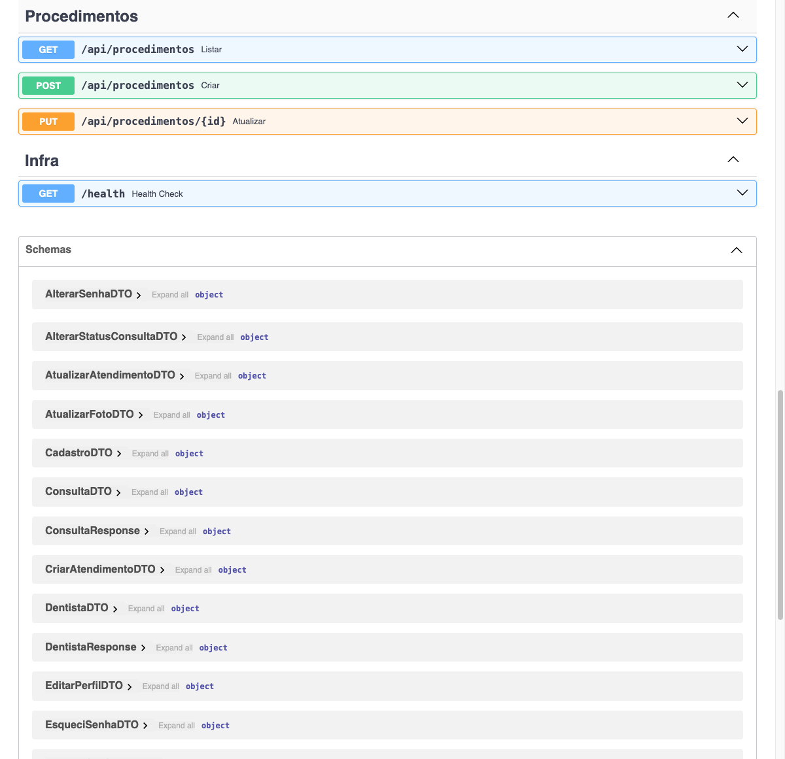
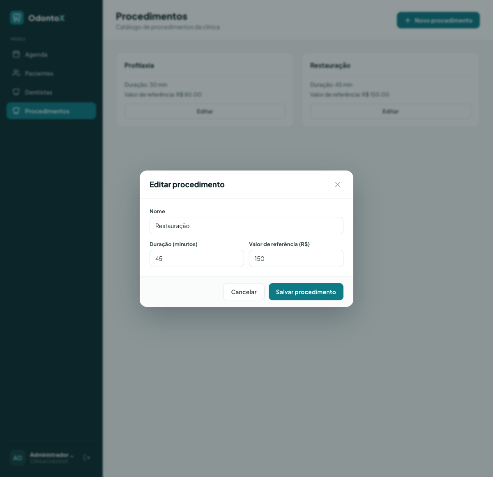
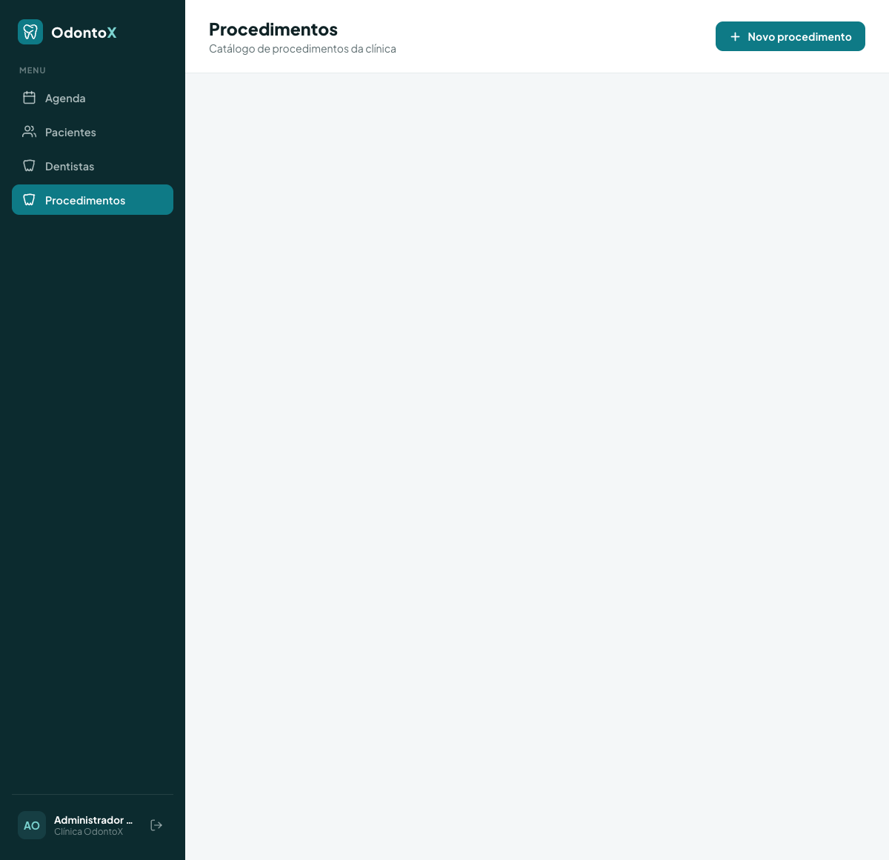
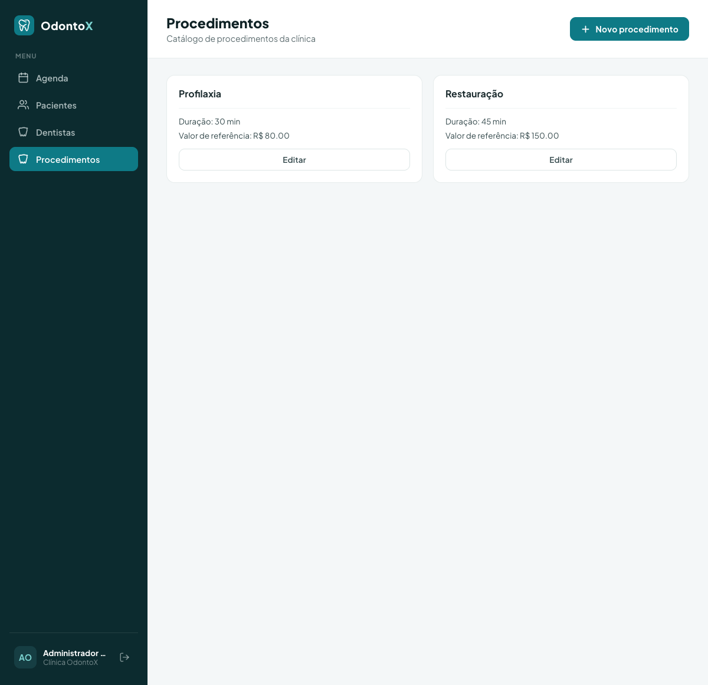
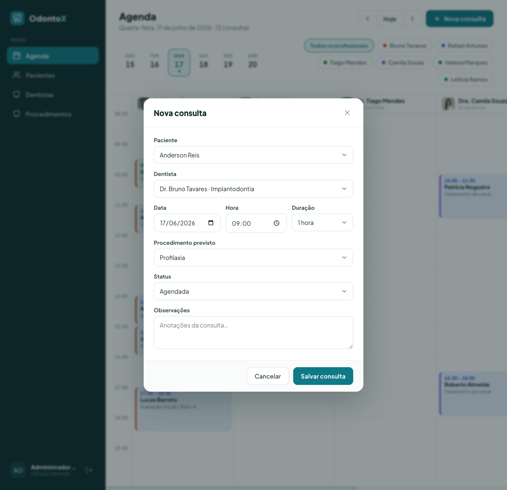

# Tutorial — CRUD de Procedimentos + select no formulário de consulta

> Tutorial passo a passo, do zero ao funcionando. Leia com calma e siga **na ordem**. Não pule etapas. Cada passo mostra o **caminho completo do arquivo**, se ele é **NOVO** ou **EDIÇÃO**, o **código** e uma explicação curta. Se você seguir tudo certinho, a feature vai funcionar.

---

# SETUP — Preparando o seu computador do zero

Antes de mexer em qualquer código, você precisa deixar o ambiente pronto. Esta seção parte do zero: vamos instalar os programas, baixar o projeto, instalar as dependências (os pacotes que o projeto precisa para rodar) e ligar tudo. Faça **na ordem**.

## 1. Instalar os programas

Você vai precisar de quatro programas. Em seguida explico o que cada um faz e como conferir se já está instalado.

- **Git** — o programa que baixa o projeto da internet e guarda o histórico de mudanças do código.
- **Python 3.11 ou mais novo** — a linguagem em que o backend (o servidor que guarda os dados) é escrito.
- **Bun** — o programa que instala e roda as partes do frontend (a tela que aparece no navegador). É o nosso gerenciador oficial aqui; **não use npm**.
- **VSCode** — o editor de código onde você vai escrever tudo.

Instale por estes sites oficiais:

- Git: https://git-scm.com/downloads
- Python: https://www.python.org/downloads/ (na instalação no Windows, marque a caixa **"Add Python to PATH"**)
- Bun: https://bun.sh (siga o comando de instalação da página)
- VSCode: https://code.visualstudio.com/

Depois de instalar, abra um terminal e confira se tudo respondeu. Cada comando abaixo deve mostrar um número de versão (e não um erro de "comando não encontrado"):

```bash
git --version
python --version
bun --version
```

> Atenção ao Python: o projeto tem um arquivo chamado `.python-version` que pede a versão `3.14`, que talvez nem exista ainda no seu computador. Ignore esse número. Mais à frente vamos criar um ambiente próprio do projeto usando o **Python 3.11** (ou mais novo), e tudo funciona. Se o `python --version` mostrar 3.11, 3.12 ou 3.13, está ótimo. Em alguns sistemas o comando é `python3` em vez de `python` — se `python` não funcionar, tente `python3`.

## 2. Baixar (clonar) o projeto

"Clonar" é o nome que o Git dá para baixar uma cópia completa do projeto. Escolha uma pasta onde você guarda seus trabalhos, abra o terminal nela e rode:

```bash
git clone https://github.com/matheuscostabeber/odontox.git
cd odontox
```

A partir de agora, todos os comandos partem de dentro dessa pasta `odontox`.

## 3. Criar uma branch para o seu trabalho

Uma **branch** é uma linha de trabalho separada dentro do Git: é como uma cópia paralela do código onde você faz suas mudanças sem bagunçar a versão principal (a `main`). Se algo der errado, você descarta a branch e a `main` continua intacta. É a forma segura e profissional de trabalhar.

Crie e entre na sua branch:

```bash
git checkout -b minha-feature
```

O `-b` cria a branch nova e já te coloca dentro dela. Daqui pra frente tudo que você fizer fica nessa branch.

## 4. Preparar o backend (Python)

O backend mora na pasta `backend`. Vamos criar um **ambiente virtual** (a famosa `venv`): uma "caixa" isolada onde ficam só os pacotes deste projeto, sem misturar com o resto do seu computador. Assim um projeto não atrapalha o outro.

```bash
cd backend
python -m venv .venv
```

Agora **ative** a venv (isso liga a caixa isolada para o seu terminal). O comando muda conforme o sistema:

```bash
# macOS / Linux
source .venv/bin/activate

# Windows (PowerShell)
.venv\Scripts\Activate.ps1
```

> Se o `python -m venv` reclamar da versão, force o Python 3.11: troque `python` por `python3.11` no comando de criação (ex.: `python3.11 -m venv .venv`). É por isso que não usamos o número do `.python-version`.

Com a venv ativada, instale os pacotes que o backend precisa:

```bash
pip install -r requirements.txt
```

O arquivo `requirements.txt` é a lista de pacotes do projeto; o `pip` lê essa lista e baixa cada um.

## 5. Preparar o frontend (Bun)

O frontend mora na pasta `frontend`. A partir da raiz do projeto:

```bash
cd ../frontend
bun install
```

O `bun install` lê a lista de dependências do frontend e baixa tudo. (Onde tutoriais antigos mandavam `npm install`, aqui é sempre `bun install`.)

## 6. Ligar os dois servidores

A aplicação tem duas partes que rodam ao mesmo tempo: o backend e o frontend. Abra **dois terminais** (um para cada) e deixe os dois abertos enquanto trabalha.

**Terminal 1 — backend** (na pasta `backend`, com a venv ativada):

```bash
.venv/bin/python main.py
```

**Terminal 2 — frontend** (na pasta `frontend`):

```bash
bun run dev
```

Abra `http://localhost:5180` no navegador. Se a tela de login do OdontoX aparecer, o ambiente está pronto.

## 7. Extensões do VSCode

No VSCode, abra a aba de extensões (ícone de blocos na barra lateral, ou `Ctrl+Shift+X`) e instale estas. Uma linha explicando cada uma:

- **Python** — suporte básico à linguagem Python (rodar, depurar, reconhecer arquivos `.py`).
- **Pylance** — autocompletar inteligente e checagem de tipos enquanto você digita Python.
- **Python Debugger** — permite pausar o código e investigar passo a passo o que está acontecendo.
- **Python Environments** — ajuda a escolher e gerenciar qual venv o VSCode está usando.
- **ESLint** — aponta erros e problemas de estilo no código do frontend (JavaScript/TypeScript).
- **SQLite3 Editor** — abre e edita o banco de dados SQLite direto dentro do VSCode, para você espiar as tabelas.
- **vscode-icons** — coloca ícones bonitos nos arquivos, deixando a árvore de pastas mais fácil de ler.
- **HTML CSS Support** — autocompletar e dicas para HTML e CSS.

Com o ambiente pronto, siga para o tutorial.

---

## O que você vai construir

Você vai adicionar uma "coisa" nova ao sistema OdontoX chamada **Procedimento** (com os campos `nome`, `duracao_minutos` e `valor_referencia`). Em programação, cada tipo de informação que o sistema guarda é chamado de **entidade** — pense nela como o molde de uma ficha. Você vai copiar fielmente o padrão que já existe para a entidade **Dentista**, só trocando os campos. Será um **CRUD** completo: CRUD é a sigla das quatro operações básicas com dados — **C**riar, **R**ead (ler/listar), **U**pdate (editar) e **D**elete (apagar). Aqui vamos fazer criar, listar e editar, do começo ao fim: desde o banco de dados (SQLite, o programa que guarda os dados em disco) até uma página feita em React (a biblioteca que monta a tela no navegador).

No final, a lista de procedimentos que você cadastrar vai aparecer num **campo de seleção (select)** — aquela caixinha de onde você escolhe uma opção pronta — dentro do formulário de agendamento de consulta. Hoje esse campo é texto livre (a pessoa digita o que quiser) e vamos trocá-lo por essa lista pronta, evitando erros de digitação.

Resultado final que você vai ter:

- Uma **tabela `procedimento`** no banco, criada sozinha quando o backend liga.
- Um **endpoint REST** `/api/procedimentos` com `GET`, `POST` e `PUT`. Um **endpoint** é um "endereço" da API — uma porta de entrada onde o frontend bate para pedir ou enviar dados. Cada verbo faz uma coisa: `GET` lista, `POST` cria, `PUT` edita.
- A lista de procedimentos incluída no **agregador** `GET /api/clinica/dados`. "Agregador" aqui é só um endpoint que junta vários dados de uma vez — é a carga inicial que o site puxa logo quando abre (esse site é um **SPA**, sigla de *Single Page Application*: um site de página única que carrega os dados uma vez e troca telas sem recarregar a página inteira).
- Um **tipo TypeScript** `Procedimento` e chamadas no cliente de domínio do front. Um "tipo" no TypeScript é uma descrição do formato dos dados — ele avisa o editor (e você) sobre quais campos existem.
- Uma **página nova** `/procedimentos` com lista e formulário, acessível pela **Sidebar** (o menu lateral).
- O campo "Procedimento previsto" do **formulário de consulta** virou um **select** alimentado por essa lista.

---

## Pré-requisitos

Antes de começar, deixe os dois servidores rodando (você já fez isso no Setup; aqui é só relembrar). Abra **dois terminais**.

### Terminal 1 — Backend (rodar a partir da pasta `backend/`)

Lembra do `.python-version` que pedia uma versão estranha de Python? Por isso, **sempre** use o Python que está dentro da `venv` do projeto — assim você garante a versão certa e os pacotes certos:

```bash
cd backend
.venv/bin/python main.py
```

O backend liga (em modo de desenvolvimento, na porta `8400`). A documentação interativa da API fica em `http://localhost:8400/docs` — é uma página pronta onde você vê e testa os endpoints.

> Dica: deixe esse terminal aberto. Quando você editar arquivos `.py`, o servidor se reinicia sozinho para pegar a mudança. Se não reiniciar, pare com `Ctrl+C` e rode de novo.

### Terminal 2 — Frontend (rodar a partir da pasta `frontend/`)

```bash
cd frontend
bun run dev
```

O Vite (a ferramenta que serve o frontend) liga na porta `5180` e encaminha tudo que começa com `/api` para o backend. Abra `http://localhost:5180` no navegador.

### Login

A aplicação só funciona com um usuário logado. Use o usuário que já vem cadastrado de fábrica (chamamos de usuário-semente, porque vem do *seed* — os dados iniciais que o projeto planta no banco):

- E-mail: `odontox@ifes.site`
- (A senha vem junto do seed; se não souber, pergunte ao seu professor ou veja no arquivo de seed do projeto.)

---

## As camadas que vamos tocar e a ORDEM de implementação

O backend deste projeto é organizado em **camadas**, como andares de um prédio: **Routes → DTOs → Repos → SQL → DB**. As Routes recebem os pedidos da internet; os DTOs descrevem o formato dos dados; os Repos falam com o banco; o SQL guarda os comandos do banco; e o DB é o banco em si. (Um **DTO**, *Data Transfer Object*, é um objeto que só serve para carregar dados de um lado para o outro com um formato bem definido — vamos ver de perto mais adiante.) O projeto não usa ORM (uma ferramenta que escreveria o SQL por você); aqui o SQL é escrito à mão.

O segredo para não se perder é construir **de baixo para cima**: primeiro a base (o banco), depois o que usa a base, e por último a tela. Por quê? Porque assim, quando você testar uma camada, tudo que está embaixo dela já existe e funciona — você nunca testa no vazio.

Ordem que vamos seguir:

**Backend**

1. `backend/sql/procedimento_sql.py` — **(NOVO)** as queries SQL (cria tabela, insere, lista, etc.).
2. `backend/model/procedimento_model.py` — **(NOVO)** o `@dataclass` de domínio.
3. `backend/repo/procedimento_repo.py` — **(NOVO)** funções que executam o SQL.
4. `backend/dtos/procedimento_dto.py` — **(NOVO)** o DTO de **entrada** (o que o front envia).
5. `backend/dtos/responses/procedimento_response.py` — **(NOVO)** o DTO de **saída** (o que a API responde).
6. `backend/routes/procedimento_routes.py` — **(NOVO)** o router com os endpoints.
7. `backend/main.py` — **(EDIÇÃO)** registrar a **tabela** no startup e o **router** sob `/api`.
8. `backend/routes/clinica_routes.py` — **(EDIÇÃO)** incluir a lista de procedimentos no agregador `/clinica/dados`.

**Frontend**

9. `frontend/src/lib/types.ts` — **(EDIÇÃO)** o tipo `Procedimento`.
10. `frontend/src/lib/odontox/clinicaApi.ts` — **(EDIÇÃO)** `DadosClinica` ganha `procedimentos` + chamadas CRUD.
11. `frontend/src/context/ClinicContext.tsx` — **(EDIÇÃO)** estado e ações `saveProcedimento`.
12. `frontend/src/components/odontox/modals/ProcedimentoFormModal.tsx` — **(NOVO)** o modal de formulário.
13. `frontend/src/components/odontox/modals/ModalRoot.tsx` — **(EDIÇÃO)** registrar o novo modal.
14. `frontend/src/pages/odontox/ProcedimentosPage.tsx` — **(NOVO)** a página.
15. `frontend/src/router.tsx` — **(EDIÇÃO)** a rota `/procedimentos`.
16. `frontend/src/components/odontox/Sidebar.tsx` — **(EDIÇÃO)** o item de menu.
17. `frontend/src/components/odontox/modals/ConsultaFormModal.tsx` — **(EDIÇÃO)** trocar o texto livre por um select.

**Por que essa ordem?** Cada arquivo precisa de algo que veio antes dele. O repo usa o SQL e o model; o router usa o DTO, o response e o repo; o front usa o tipo. Se você criasse a tela primeiro, nada funcionaria, porque o endpoint que ela chama ainda não existiria. Indo de baixo para cima, você consegue testar cada pedaço assim que termina.

> ⚠️ Os passos **7** (registrar tabela e router no `main.py`) e **15/16** (registrar rota e menu) são os que os alunos **mais esquecem**. Sem eles, a tabela não é criada, o endpoint responde "não existe" (erro 404) e a página não aparece. Preste atenção dobrada neles.

---

# PARTE 1 — BACKEND

## Passo 1 — SQL da entidade

**Arquivo:** `backend/sql/procedimento_sql.py`
**Tipo:** ARQUIVO NOVO

Cada entidade tem um arquivo de SQL com os comandos do banco guardados em **constantes de texto** (variáveis com um valor fixo). Vamos copiar a estrutura de `sql/dentista_sql.py`, só trocando os campos. Repare nos `?` no meio dos comandos: eles são espaços reservados que o banco preenche depois, com segurança. **Nunca** grude o valor direto no texto do comando (com f-string), porque isso abre brecha para um tipo de ataque famoso (injeção de SQL). O `?` evita esse problema.

```python
CRIAR_TABELA = """
CREATE TABLE IF NOT EXISTS procedimento (
    id INTEGER PRIMARY KEY AUTOINCREMENT,
    nome TEXT NOT NULL,
    duracao_minutos INTEGER NOT NULL DEFAULT 30,
    valor_referencia REAL NOT NULL DEFAULT 0
)
"""

INSERIR = """
INSERT INTO procedimento (nome, duracao_minutos, valor_referencia)
VALUES (?, ?, ?)
"""

OBTER_TODOS = """
SELECT id, nome, duracao_minutos, valor_referencia
FROM procedimento
ORDER BY nome
"""

OBTER_POR_ID = """
SELECT id, nome, duracao_minutos, valor_referencia
FROM procedimento
WHERE id = ?
"""

ATUALIZAR = """
UPDATE procedimento
SET nome = ?, duracao_minutos = ?, valor_referencia = ?
WHERE id = ?
"""
```

Pontos importantes:

- `id INTEGER PRIMARY KEY AUTOINCREMENT`: o banco cria o número de identificação (id) sozinho, sem você precisar inventar um.
- `duracao_minutos` é `INTEGER` (número inteiro de minutos).
- `valor_referencia` é `REAL` (número com casas decimais, o "preço base").
- `CREATE TABLE IF NOT EXISTS`: só cria a tabela se ela ainda não existir. Por isso pode rodar várias vezes sem dar erro — útil porque o backend roda esse comando toda vez que liga.
- A ordem das colunas no `INSERT`/`SELECT`/`UPDATE` precisa **bater** com a ordem dos `?` que o repo vai passar. Se trocar a ordem de um lado só, os valores entram na coluna errada. Mantenha igual.

---

## Passo 2 — Model (entidade de domínio)

**Arquivo:** `backend/model/procedimento_model.py`
**Tipo:** ARQUIVO NOVO

O model (modelo) é a ficha que representa um procedimento dentro do código Python. Aqui ele é um `@dataclass` simples — um atalho do Python para criar uma classe que só guarda dados. Os nomes dos campos ficam em `snake_case` (palavras separadas por sublinhado, como `duracao_minutos`). Copiamos o estilo de `model/dentista_model.py`.

```python
from dataclasses import dataclass


@dataclass
class Procedimento:
    id: int
    nome: str
    duracao_minutos: int
    valor_referencia: float
```

Pontos importantes:

- É só uma "caixinha de dados" com os tipos anotados (texto, número etc.). Não tem lógica nem mexe no banco.
- Os nomes dos campos são **iguais aos da tabela** (em `snake_case`). Isso facilita transformar uma linha do banco nessa ficha.

---

## Passo 3 — Repo (funções que falam com o banco)

**Arquivo:** `backend/repo/procedimento_repo.py`
**Tipo:** ARQUIVO NOVO

O repo (repositório) é a camada que conversa com o banco. Ele pega os comandos SQL do Passo 1 e oferece **funções soltas** (não usamos classes aqui). Cada função pede uma conexão com o banco usando `obter_conexao()`. Esse `obter_conexao()` é esperto: se tudo der certo, ele salva as mudanças (commit); se der erro no meio, ele desfaz tudo (rollback), evitando deixar o banco pela metade. Copiamos fielmente `repo/dentista_repo.py`.

```python
"""Repositório de Procedimentos."""

import sqlite3
from typing import Optional

from model.procedimento_model import Procedimento
from sql.procedimento_sql import (
    CRIAR_TABELA,
    INSERIR,
    OBTER_TODOS,
    OBTER_POR_ID,
    ATUALIZAR,
)
from util.db_util import obter_conexao
from util.logger_config import logger


def _row_to_procedimento(row: sqlite3.Row) -> Procedimento:
    return Procedimento(
        id=row["id"],
        nome=row["nome"],
        duracao_minutos=row["duracao_minutos"],
        valor_referencia=row["valor_referencia"],
    )


def criar_tabela() -> bool:
    with obter_conexao() as conn:
        cursor = conn.cursor()
        cursor.execute(CRIAR_TABELA)
        return True


def inserir(procedimento: Procedimento) -> Optional[int]:
    with obter_conexao() as conn:
        cursor = conn.cursor()
        cursor.execute(INSERIR, (
            procedimento.nome,
            procedimento.duracao_minutos,
            procedimento.valor_referencia,
        ))
        return cursor.lastrowid


def obter_todos() -> list[Procedimento]:
    with obter_conexao() as conn:
        cursor = conn.cursor()
        cursor.execute(OBTER_TODOS)
        rows = cursor.fetchall()
        return [_row_to_procedimento(row) for row in rows]


def obter_por_id(id: int) -> Optional[Procedimento]:
    with obter_conexao() as conn:
        cursor = conn.cursor()
        cursor.execute(OBTER_POR_ID, (id,))
        row = cursor.fetchone()
        if row:
            return _row_to_procedimento(row)
        return None


def atualizar(procedimento: Procedimento) -> bool:
    with obter_conexao() as conn:
        cursor = conn.cursor()
        cursor.execute(ATUALIZAR, (
            procedimento.nome,
            procedimento.duracao_minutos,
            procedimento.valor_referencia,
            procedimento.id,
        ))
        return cursor.rowcount > 0
```

Pontos importantes:

- `_row_to_procedimento(row)`: uma função de uso interno (o `_` no nome avisa "isso é detalhe interno") que pega uma linha crua do banco e monta a ficha (model). No dentista ela ainda trata campos vazios e converte número↔verdadeiro/falso; aqui não precisamos disso porque todos os campos são obrigatórios e têm valor padrão.
- `inserir(...)` devolve `cursor.lastrowid`, que é o id que o banco acabou de gerar para o registro novo.
- `atualizar(...)` devolve `cursor.rowcount > 0`, ou seja, `True` se realmente mudou alguma linha (e `False` se não achou nada para mudar).
- A **ordem** dos valores passados ao `execute` precisa bater com a ordem dos `?` no SQL. Compare com o Passo 1.
- `criar_tabela()` é a função que o `main.py` vai chamar quando o backend liga (Passo 7).
- Importamos o `logger` (a ferramenta que escreve mensagens no log) mesmo sem usar agora, só para manter o mesmo padrão dos outros arquivos. Se o seu corretor de código reclamar de import sem uso, pode tirar — mas o `dentista_repo` mantém, então deixe igual.

---

## Passo 4 — DTO de entrada (o que o front envia)

**Arquivo:** `backend/dtos/procedimento_dto.py`
**Tipo:** ARQUIVO NOVO

O DTO de entrada descreve **exatamente** os dados que o front manda quando cria ou edita um procedimento. Ele é um `BaseModel` do Pydantic — uma ferramenta que confere se o que chegou tem o formato certo e recusa o que estiver errado. Os dados chegam em **JSON** (um formato de texto para trocar dados, tipo uma lista de pares "campo: valor"). Copiamos o estilo de `dtos/dentista_dto.py`.

```python
from pydantic import BaseModel, Field


class ProcedimentoDTO(BaseModel):
    """DTO para criação/edição de procedimento."""

    nome: str = Field(..., description="Nome do procedimento")
    duracao_minutos: int = Field(default=30, description="Duração padrão em minutos")
    valor_referencia: float = Field(default=0, description="Valor de referência (R$)")
```

Pontos importantes:

- `nome: str = Field(...)` → o `...` quer dizer **obrigatório**. Se o front não mandar `nome`, o Pydantic já recusa sozinho e responde com o erro **422** (que significa "os dados enviados não servem").
- `duracao_minutos` e `valor_referencia` têm valor padrão (`default`), então são opcionais — se não vierem, usam o padrão.
- **Importante (o "combinado" entre front e back):** os nomes dos campos aqui precisam ser idênticos aos que o front envia. Os dois lados precisam falar a mesma língua. Aqui vamos usar `snake_case` (`duracao_minutos`, `valor_referencia`) tanto no envio do front quanto neste DTO. **Não escreva de um jeito num lado e de outro no outro**, senão os dados não casam.

---

## Passo 5 — Response (o que a API devolve)

**Arquivo:** `backend/dtos/responses/procedimento_response.py`
**Tipo:** ARQUIVO NOVO

O Response descreve os dados de **saída** (o que a API devolve para o front) e tem um *classmethod* — uma função da própria classe — que monta essa resposta a partir do model. É aqui que acontece a tradução de `snake_case` (no banco) para `camelCase` (palavras coladas com a inicial maiúscula no meio, como `duracaoMinutos`), que é o estilo usado no front. Copiamos `dtos/responses/dentista_response.py`.

Para deixar tudo combinando com o tipo do front, vamos usar `duracaoMinutos` e `valorReferencia` (em camelCase) na saída da API. Atenção: **o que sai daqui precisa ser idêntico ao tipo TypeScript do Passo 9.** Seguimos o mesmo padrão do `fotoUrl` do dentista.

```python
"""Schemas de resposta do módulo de procedimentos."""

from pydantic import BaseModel, Field

from model.procedimento_model import Procedimento


class ProcedimentoResponse(BaseModel):
    """Representação de um procedimento."""

    id: int
    nome: str
    duracaoMinutos: int = Field(..., description="Duração padrão em minutos")
    valorReferencia: float = Field(..., description="Valor de referência (R$)")

    @classmethod
    def de_procedimento(cls, procedimento: Procedimento) -> "ProcedimentoResponse":
        """Constrói o response a partir da entidade de domínio."""
        return cls(
            id=procedimento.id,
            nome=procedimento.nome,
            duracaoMinutos=procedimento.duracao_minutos,
            valorReferencia=procedimento.valor_referencia,
        )
```

Pontos importantes:

- `duracaoMinutos`/`valorReferencia` (camelCase, na API) correspondem a `duracao_minutos`/`valor_referencia` (snake_case, no model e no banco). A tradução acontece **só aqui**, dentro do `de_procedimento`.
- Esse `de_procedimento` é o que o router (Passo 6) vai usar para montar a resposta. Compare com `DentistaResponse.de_dentista`.

> Decisão sobre os nomes: o **DTO de entrada** (Passo 4) usa `snake_case` e o **Response de saída** usa `camelCase`. Isso copia exatamente o dentista (entrada `cro`, saída `fotoUrl` etc.). Resumindo: o que o front **envia** vai em snake_case e o que ele **recebe** vem em camelCase. Cuidamos disso no Passo 9/10.

---

## Passo 6 — Router (os endpoints)

**Arquivo:** `backend/routes/procedimento_routes.py`
**Tipo:** ARQUIVO NOVO

O router (roteador) é o arquivo que define os endpoints — os "endereços" da API. Cada função que responde a um endereço é chamada de *handler* (tratador). Aqui todo handler começa com `request: Request` como **primeiro parâmetro** e termina com `usuario_logado: Optional[UsuarioLogado] = None`. O `@requer_autenticacao()` é um *decorator* (um marcador que adiciona um comportamento à função): ele só deixa passar quem está logado — se for um visitante anônimo, responde com erro 401 ("não autorizado") — e entrega quem é o usuário logado. Copiamos `routes/dentista_routes.py` (tirando a parte de cor/foto, que é só do dentista).

```python
"""
Rotas para gerenciamento de procedimentos (API JSON).

Permite que usuários logados:
- Listem procedimentos
- Cadastrem novos procedimentos
- Editem procedimentos
"""

from typing import Optional

from fastapi import APIRouter, HTTPException, Request, status

# DTOs (entrada)
from dtos.procedimento_dto import ProcedimentoDTO

# Schemas (saída)
from dtos.responses.procedimento_response import ProcedimentoResponse

# Models
from model.procedimento_model import Procedimento
from model.usuario_logado_model import UsuarioLogado

# Repositories
from repo import procedimento_repo

# Utilities
from util.auth_decorator import requer_autenticacao
from util.logger_config import logger

router = APIRouter(prefix="/procedimentos")


# ---- Listagem ----

@router.get("", response_model=list[ProcedimentoResponse])
@requer_autenticacao()
async def listar(
    request: Request,
    usuario_logado: Optional[UsuarioLogado] = None,
):
    """Lista todos os procedimentos (ordenados por nome)."""
    assert usuario_logado is not None
    procedimentos = procedimento_repo.obter_todos()
    return [ProcedimentoResponse.de_procedimento(p) for p in procedimentos]


# ---- Criação ----

@router.post(
    "",
    response_model=ProcedimentoResponse,
    status_code=status.HTTP_201_CREATED,
)
@requer_autenticacao()
async def criar(
    request: Request,
    dto: ProcedimentoDTO,
    usuario_logado: Optional[UsuarioLogado] = None,
):
    """Cadastra um novo procedimento."""
    assert usuario_logado is not None

    procedimento = Procedimento(
        id=0,
        nome=dto.nome,
        duracao_minutos=dto.duracao_minutos,
        valor_referencia=dto.valor_referencia,
    )
    procedimento_id = procedimento_repo.inserir(procedimento)
    if not procedimento_id:
        raise HTTPException(
            status_code=status.HTTP_500_INTERNAL_SERVER_ERROR,
            detail="Erro ao cadastrar o procedimento. Tente novamente.",
        )

    logger.info(f"Procedimento #{procedimento_id} '{dto.nome}' criado por usuário {usuario_logado.id}")

    criado = procedimento_repo.obter_por_id(procedimento_id)
    return ProcedimentoResponse.de_procedimento(criado)


# ---- Edição ----

@router.put("/{id}", response_model=ProcedimentoResponse)
@requer_autenticacao()
async def atualizar(
    request: Request,
    id: int,
    dto: ProcedimentoDTO,
    usuario_logado: Optional[UsuarioLogado] = None,
):
    """Atualiza um procedimento existente."""
    assert usuario_logado is not None

    existente = procedimento_repo.obter_por_id(id)
    if not existente:
        raise HTTPException(
            status_code=status.HTTP_404_NOT_FOUND,
            detail="Procedimento não encontrado.",
        )

    procedimento = Procedimento(
        id=id,
        nome=dto.nome,
        duracao_minutos=dto.duracao_minutos,
        valor_referencia=dto.valor_referencia,
    )
    procedimento_repo.atualizar(procedimento)

    logger.info(f"Procedimento #{id} atualizado por usuário {usuario_logado.id}")

    atualizado = procedimento_repo.obter_por_id(id)
    return ProcedimentoResponse.de_procedimento(atualizado)
```

Pontos importantes:

- `router = APIRouter(prefix="/procedimentos")` → esse prefixo **NÃO** inclui o `/api`. Quem adiciona o `/api` é o `main.py`. Juntando os dois, o endereço final vira `/api/procedimentos`.
- Todo handler tem `request: Request` no começo e `usuario_logado: Optional[UsuarioLogado] = None` no fim. O `@requer_autenticacao()` só funciona com a função escrita exatamente nesse formato.
- O `@requer_autenticacao()` fica **logo abaixo** do marcador de rota (`@router.get/post/put`). A ordem importa.
- No `criar`, montamos um `Procedimento` com `id=0` (um id de mentira só para criar o objeto), salvamos no banco, pegamos o id de verdade que o banco gerou e devolvemos o registro recém-criado já no formato de saída.
- No `atualizar`, primeiro checamos se o procedimento existe (se não existe, respondemos 404 "não encontrado"). Só então atualizamos e devolvemos a versão nova.
- Erros sempre com `raise HTTPException(status_code=..., detail="...")`. O projeto tem um tratamento central que transforma isso numa resposta padronizada (`{detail, type, errors}`).
- Não tem `DELETE` (apagar) neste tutorial, porque copiamos o dentista, que também não apaga. Se quiser, dá para adicionar depois.

---

## Passo 7 — Registrar a TABELA e o ROUTER no startup ⚠️

**Arquivo:** `backend/main.py`
**Tipo:** EDIÇÃO

Este é o passo que **mais gente esquece**. Sem ele, a tabela `procedimento` nunca nasce e o endpoint responde 404 ("não existe"). São algumas edições pequenas, todas no mesmo arquivo.

### 7.1 — Importar o repo novo

Procure o bloco de import dos repositórios (perto da linha 26). Está assim:

```python
# Repositórios (criação das tabelas)
from repo import (
    usuario_repo,
    configuracao_repo,
    indices_repo,
    dentista_repo,
    paciente_repo,
    consulta_repo,
    atendimento_repo,
)
```

Adicione `procedimento_repo` na lista:

```python
# Repositórios (criação das tabelas)
from repo import (
    usuario_repo,
    configuracao_repo,
    indices_repo,
    dentista_repo,
    paciente_repo,
    consulta_repo,
    atendimento_repo,
    procedimento_repo,
)
```

### 7.2 — Importar o router novo

Logo abaixo, procure o bloco de import das rotas (perto da linha 37):

```python
# Rotas (API JSON)
from routes.auth_routes import router as auth_router
from routes.usuario_routes import router as usuario_router
from routes.clinica_routes import router as clinica_router
from routes.dentista_routes import router as dentista_router
from routes.paciente_routes import router as paciente_router
from routes.consulta_routes import router as consulta_router
from routes.atendimento_routes import router as atendimento_router
```

Adicione a linha do procedimento:

```python
from routes.procedimento_routes import router as procedimento_router
```

### 7.3 — Registrar a tabela na lista `TABELAS`

Procure a lista `TABELAS` (perto da linha 90):

```python
TABELAS = [
    (usuario_repo, "usuario"),
    (configuracao_repo, "configuracao"),
    (dentista_repo, "dentista"),
    (paciente_repo, "paciente"),
    (consulta_repo, "consulta"),
    (atendimento_repo, "atendimento"),
]
```

Adicione a tupla do procedimento:

```python
TABELAS = [
    (usuario_repo, "usuario"),
    (configuracao_repo, "configuracao"),
    (dentista_repo, "dentista"),
    (paciente_repo, "paciente"),
    (consulta_repo, "consulta"),
    (atendimento_repo, "atendimento"),
    (procedimento_repo, "procedimento"),
]
```

O laço logo abaixo (`for repo, nome in TABELAS: repo.criar_tabela()`) passa por cada item da lista e chama o `criar_tabela()` dele quando o backend liga. Adicionando o procedimento aqui, **é isso que faz a tabela nascer no banco.**

### 7.4 — Registrar o router na lista `ROUTERS`

Procure a lista `ROUTERS` (perto da linha 125):

```python
ROUTERS = [
    (auth_router, ["Autenticação"], "autenticação"),
    (usuario_router, ["Usuário"], "usuário"),
    (clinica_router, ["Clinica"], "clinica"),
    (dentista_router, ["Dentistas"], "dentistas"),
    (paciente_router, ["Pacientes"], "pacientes"),
    (consulta_router, ["Consultas"], "consultas"),
    (atendimento_router, ["Atendimentos"], "atendimentos"),
]
```

Adicione a tupla do procedimento:

```python
ROUTERS = [
    (auth_router, ["Autenticação"], "autenticação"),
    (usuario_router, ["Usuário"], "usuário"),
    (clinica_router, ["Clinica"], "clinica"),
    (dentista_router, ["Dentistas"], "dentistas"),
    (paciente_router, ["Pacientes"], "pacientes"),
    (consulta_router, ["Consultas"], "consultas"),
    (atendimento_router, ["Atendimentos"], "atendimentos"),
    (procedimento_router, ["Procedimentos"], "procedimentos"),
]
```

O laço `for router, tags, nome in ROUTERS: app.include_router(router, prefix=API_PREFIX, ...)` liga cada router debaixo de `/api`. Como o nosso router já tem `prefix="/procedimentos"`, o endereço final fica `/api/procedimentos`.

> ✅ Depois desta edição, **reinicie o backend** (Ctrl+C e `.venv/bin/python main.py`). Procure no log a linha `Tabela 'procedimento' criada/verificada` e `Router de procedimentos incluído em /api`. Se as duas aparecerem, deu certo.

---

## Passo 8 — Incluir procedimentos no agregador `/clinica/dados`

**Arquivo:** `backend/routes/clinica_routes.py`
**Tipo:** EDIÇÃO

Lembra que o site (o SPA) puxa tudo de uma vez quando abre, pelo `GET /clinica/dados`? Vamos colocar a lista de procedimentos junto dessa carga inicial, para a tela já ter os dados na mão. São duas edições no arquivo.

### 8.1 — Importar o response e o repo

No topo do arquivo, encontre os imports de schemas e de repos:

```python
# Schemas (saída)
from dtos.responses.dentista_response import DentistaResponse
from dtos.responses.paciente_response import PacienteResponse
from dtos.responses.consulta_response import ConsultaResponse
from dtos.responses.atendimento_response import AtendimentoResponse
```

Adicione o response de procedimento:

```python
from dtos.responses.procedimento_response import ProcedimentoResponse
```

E no bloco de repositórios:

```python
# Repositories
from repo import (
    dentista_repo,
    paciente_repo,
    consulta_repo,
    atendimento_repo,
)
```

Adicione `procedimento_repo`:

```python
# Repositories
from repo import (
    dentista_repo,
    paciente_repo,
    consulta_repo,
    atendimento_repo,
    procedimento_repo,
)
```

### 8.2 — Adicionar a chave no JSON de resposta

Encontre o `return` do handler `dados` e adicione a chave `procedimentos`:

```python
    return {
        "dentists": [
            DentistaResponse.de_dentista(d) for d in dentista_repo.obter_todos()
        ],
        "patients": [
            PacienteResponse.de_paciente(p) for p in paciente_repo.obter_todos()
        ],
        "consultas": [
            ConsultaResponse.de_consulta(c) for c in consulta_repo.obter_todos()
        ],
        "atendimentos": [
            AtendimentoResponse.de_atendimento(a)
            for a in atendimento_repo.obter_todos()
        ],
        "procedimentos": [
            ProcedimentoResponse.de_procedimento(p)
            for p in procedimento_repo.obter_todos()
        ],
    }
```

Pontos importantes:

- A chave `"procedimentos"` é o nome exato que o front vai procurar em `DadosClinica` (Passo 10). **Os dois lados têm que escrever igualzinho.**

> Neste ponto o backend está pronto. Teste no navegador: acesse `http://localhost:8400/docs`, faça login pelo front (para o navegador ganhar o cookie que prova que você está logado) e veja se o endpoint `GET /procedimentos` aparece na documentação. Dá até para criar um procedimento direto por ali, pelo `/docs`.



---

# PARTE 2 — FRONTEND

## Passo 9 — Tipo TypeScript `Procedimento`

**Arquivo:** `frontend/src/lib/types.ts`
**Tipo:** EDIÇÃO

Os tipos do front são o espelho dos Response do backend (em camelCase): eles dizem ao TypeScript qual o formato dos dados que chegam. Encontre a seção `// ===== OdontoX — domínio da clínica =====` e adicione a interface (pode ser logo depois da interface `Dentista`):

```ts
export interface Procedimento {
  id: number
  nome: string
  duracaoMinutos: number
  valorReferencia: number
}
```

Pontos importantes:

- `duracaoMinutos` e `valorReferencia` em **camelCase**, exatamente como o `ProcedimentoResponse` devolve (Passo 5). Se você escrever `duracao_minutos` aqui, o front vai procurar um campo com esse nome, não vai achar, e a tela mostra `undefined` (vazio).

---

## Passo 10 — Cliente de domínio (`clinicaApi`)

**Arquivo:** `frontend/src/lib/odontox/clinicaApi.ts`
**Tipo:** EDIÇÃO

As páginas não falam direto com a API. Elas usam este arquivo, que é um *wrapper* (uma "embrulho") com funções prontas e organizadas para cada chamada. Três edições.

### 10.1 — Importar o tipo

No topo, encontre o import de tipos e adicione `Procedimento`:

```ts
import type { Atendimento, Consulta, Dentista, Paciente, Procedimento, StatusConsulta } from '@/lib/types'
```

### 10.2 — Incluir `procedimentos` em `DadosClinica`

Encontre a interface `DadosClinica` e adicione o campo:

```ts
export interface DadosClinica {
  dentists: Dentista[]
  patients: Paciente[]
  consultas: Consulta[]
  atendimentos: Atendimento[]
  procedimentos: Procedimento[]
}
```

> Esse campo `procedimentos` precisa ter o mesmo nome da chave `"procedimentos"` que você adicionou no backend no Passo 8.2 — é assim que o front sabe onde achar a lista.

### 10.3 — Adicionar as chamadas CRUD

Dentro do objeto `clinicaApi`, adicione um bloco com as funções de criar e editar (pode ser depois do bloco de dentistas):

```ts
  // ---- procedimentos ----
  createProcedimento: (f: Record<string, unknown>) => api.post<Procedimento>('/procedimentos', f),
  updateProcedimento: (id: number, f: Record<string, unknown>) => api.put<Procedimento>('/procedimentos/' + id, f),
```

Pontos importantes:

- Os caminhos começam **depois do `/api`** (escreva `'/procedimentos'`, não `'/api/procedimentos'`). O cliente central coloca o `/api` na frente sozinho.
- `api.post`/`api.put` já enviam o cookie de login e o cabeçalho de segurança `X-CSRF-Token` automaticamente. Você não precisa cuidar disso à mão.
- **Por que `Record<string, unknown>` (e não `Partial<Procedimento>`)?** Diferente do `createDentist`/`createPatient` (que enviam o formulário cru em camelCase), aqui montamos o pacote de dados (o *payload*) já em **snake_case** antes de mandar (Passo 11.4), porque o `ProcedimentoDTO` (Passo 4) espera `duracao_minutos`/`valor_referencia`. Esse objeto tem chaves que **não existem** no tipo `Procedimento` (que é camelCase). Por isso, `Partial<Procedimento>` faria o TypeScript reclamar e o `tsc -b` (que o tutorial manda rodar mais adiante) daria erro. `Record<string, unknown>` quer dizer "um objeto com chaves de texto e valores quaisquer" — ele aceita o payload sem brigar. **Use essa assinatura desde já; não é opcional.**
- **A regra de ouro:** o que sai daqui no `POST`/`PUT` precisa ter os mesmos nomes do `ProcedimentoDTO`. Veja no Passo 11.4 como montamos o payload em snake_case.

> Para simplificar, padronizamos **snake_case no envio** e **camelCase no recebimento**, igualzinho ao dentista com `fotoUrl`/`foto_url`. O formulário (Passo 12) usa camelCase no estado; o `ClinicContext` (Passo 11.4) traduz para snake_case na hora de enviar.

---

## Passo 11 — Estado e ação no `ClinicContext`

**Arquivo:** `frontend/src/context/ClinicContext.tsx`
**Tipo:** EDIÇÃO

O `ClinicContext` é o lugar central onde o front guarda os dados da clínica e deixa todas as telas acessarem (no React, isso se chama *context*). Vamos guardar a lista de procedimentos ali e criar uma ação `saveProcedimento` (a função de salvar). Quatro edições pequenas.

### 11.1 — Importar o tipo

No import de tipos do topo, adicione `Procedimento`:

```ts
import type { Atendimento, Consulta, Dentista, Paciente, Procedimento, StatusConsulta } from '@/lib/types'
```

### 11.2 — Adicionar à interface interna `ClinicData`

```ts
interface ClinicData {
  dentists: Dentista[]
  patients: Paciente[]
  consultas: Consulta[]
  atendimentos: Atendimento[]
  procedimentos: Procedimento[]
}
```

### 11.3 — Declarar a ação na interface `ClinicContextValue`

Encontre `interface ClinicContextValue extends ClinicData {` e adicione a assinatura (pode ser depois de `toggleDentist`):

```ts
  saveProcedimento: (form: Partial<Procedimento> & { id?: number }) => Promise<void>
```

### 11.4 — Estado inicial, ação e expor no `value`

No `useState`, adicione `procedimentos: []`:

```ts
  const [data, setData] = useState<ClinicData>({ dentists: [], patients: [], consultas: [], atendimentos: [], procedimentos: [] })
```

Crie a ação (pode colocar logo abaixo de `toggleDentist`). Repare que ela monta o **payload (pacote de dados) em snake_case** para combinar com o DTO do backend:

```ts
  // ---- procedimentos ----
  const saveProcedimento = useCallback(async (form: Partial<Procedimento> & { id?: number }) => {
    const payload = {
      nome: form.nome,
      duracao_minutos: Number(form.duracaoMinutos),
      valor_referencia: Number(form.valorReferencia),
    }
    if (form.id) {
      const updated = await api.updateProcedimento(form.id, payload)
      setData((d) => ({ ...d, procedimentos: d.procedimentos.map((x) => (x.id === form.id ? updated : x)) }))
    } else {
      const created = await api.createProcedimento(payload)
      setData((d) => ({ ...d, procedimentos: [...d.procedimentos, created] }))
    }
  }, [])
```

Por fim, adicione `saveProcedimento` no objeto `value` que o provider expõe (perto do final, junto de `toggleDentist`):

```ts
  const value: ClinicContextValue = {
    ...data,
    loading,
    dentist,
    patient,
    atendimentoFor,
    saveConsulta,
    setConsultaStatus,
    savePatient,
    saveDentist,
    toggleDentist,
    saveProcedimento,
    saveAtendimento,
  }
```

Pontos importantes:

- O `payload` traduz `duracaoMinutos → duracao_minutos` e `valorReferencia → valor_referencia` **antes de enviar**. É isso que faz o front e o `ProcedimentoDTO` (que é snake_case) falarem a mesma língua.
- A resposta (`updated`/`created`) já volta em camelCase do backend e entra no estado como `Procedimento`. Não precisa traduzir na volta.
- `Number(...)` transforma em número o que o campo de texto (`<input>`) sempre devolve como texto. Sem isso, você enviaria "30" (texto) em vez de 30 (número).
- A chamada `createProcedimento(payload)` recebe um objeto com chaves **snake_case** (`duracao_minutos`/`valor_referencia`), que **não existem** no tipo `Procedimento` (camelCase). Por isso, no Passo 10.3, as funções `createProcedimento`/`updateProcedimento` **já aceitam** `Record<string, unknown>` — e não `Partial<Procedimento>`. Isso é **obrigatório** (não opcional): com `Partial<Procedimento>`, o TypeScript reclamaria e o `npx tsc -b --noEmit` (que você roda em "Como testar") daria erro. Confirme que o Passo 10.3 está assim:
  ```ts
  createProcedimento: (f: Record<string, unknown>) => api.post<Procedimento>('/procedimentos', f),
  updateProcedimento: (id: number, f: Record<string, unknown>) => api.put<Procedimento>('/procedimentos/' + id, f),
  ```

---

## Passo 12 — Modal de formulário do procedimento

**Arquivo:** `frontend/src/components/odontox/modals/ProcedimentoFormModal.tsx`
**Tipo:** ARQUIVO NOVO

Os formulários aparecem em **modais** — aquelas janelinhas que abrem por cima da tela. Eles são abertos pelo `ModalContext` e usam o `useForm` (um *hook*, que é uma função especial do React para reaproveitar lógica; este aqui controla os campos do formulário) junto com os componentes prontos `Modal`/`ModalFooter`/`TextInput`. Copiamos a estrutura de `DentistFormModal.tsx`, deixando só os nossos três campos.

```tsx
import { useClinic } from '@/context/ClinicContext';
import { useModal } from '@/context/ModalContext';
import { useForm } from '@/hooks/useForm';
import Modal from '@/components/odontox/Modal';
import ModalFooter from '@/components/odontox/ModalFooter';
import { TextInput } from '@/components/odontox/Field';
import type { Procedimento } from '@/lib/types';

export default function ProcedimentoFormModal({ entity }: { entity?: Procedimento }) {
  const { saveProcedimento } = useClinic();
  const { close } = useModal();

  const { form, field } = useForm(
    entity
      ? { id: entity.id as number | undefined, nome: entity.nome, duracaoMinutos: entity.duracaoMinutos, valorReferencia: entity.valorReferencia }
      : { id: undefined as number | undefined, nome: '', duracaoMinutos: 30, valorReferencia: 0 }
  );

  const save = () => { saveProcedimento(form); close(); };

  return (
    <Modal onClose={close} maxWidth={520} title={entity ? 'Editar procedimento' : 'Novo procedimento'}>
      <div className="ox-scroll" style={{ padding: '22px 24px', display: 'flex', flexDirection: 'column', gap: 16, overflow: 'auto' }}>
        <TextInput label="Nome" placeholder="Ex.: Profilaxia, Restauração, Canal…" {...field('nome')} />
        <div style={{ display: 'grid', gridTemplateColumns: '1fr 1fr', gap: 12 }}>
          <TextInput label="Duração (minutos)" type="number" {...field('duracaoMinutos')} />
          <TextInput label="Valor de referência (R$)" type="number" {...field('valorReferencia')} />
        </div>
      </div>
      <ModalFooter onCancel={close} onSave={save} saveLabel="Salvar procedimento" />
    </Modal>
  );
}
```

Pontos importantes:

- `useForm(initial)` devolve `{ form, field }`. O `field('nome')` já entrega prontos o `value` (valor atual) e o `onChange` (o que fazer quando o usuário digita) para o input — você não escreve o `onChange` na mão.
- O estado do formulário usa **camelCase** (`duracaoMinutos`, `valorReferencia`) para combinar com o tipo `Procedimento`. A **tradução para snake_case** acontece lá no `ClinicContext.saveProcedimento` (Passo 11.4), não aqui.
- `type="number"` nos campos de número. Mesmo assim o valor chega como texto; o `Number(...)` no contexto converte.
- `save()` chama `saveProcedimento(form)` e fecha o modal. Sem `alert`/`confirm`.

Quando estiver pronto e você editar um procedimento existente, o modal abre com os campos já preenchidos, assim:



---

## Passo 13 — Registrar o modal no `ModalRoot`

**Arquivo:** `frontend/src/components/odontox/modals/ModalRoot.tsx`
**Tipo:** EDIÇÃO

O `ModalRoot` é o "porteiro" dos modais: ele olha o tipo do modal pedido e decide qual janelinha mostrar na tela. Duas edições.

Adicione o import no topo (junto dos outros):

```tsx
import ProcedimentoFormModal from './ProcedimentoFormModal';
```

E adicione um `case` no `switch` (junto dos outros forms):

```tsx
    case 'procedimentoForm':
      return <ProcedimentoFormModal entity={modal.entity as never} />;
```

Pontos importantes:

- A string `'procedimentoForm'` é o "nome" do modal. Você vai usar exatamente essa string ao chamar `open('procedimentoForm', ...)` na página (Passo 14). Tem que ser idêntica nos dois lugares.
- O `as never` é só um truque para o TypeScript não reclamar dos tipos — é o mesmo padrão que os outros modais usam.

---

## Passo 14 — Página de Procedimentos

**Arquivo:** `frontend/src/pages/odontox/ProcedimentosPage.tsx`
**Tipo:** ARQUIVO NOVO

A página segue o padrão do projeto: é exportada com `export default`, o nome dela é igual ao do arquivo, os estilos ficam escritos direto no JSX (*inline styles*, em vez de um arquivo CSS separado), os ícones vêm de `@/components/odontox/icons`, os dados vêm de `useClinic()` e os modais são abertos por `useModal()`. Copiamos a aparência de `DentistasPage.tsx`, trocando para os campos do procedimento.

```tsx
import { useClinic } from '@/context/ClinicContext';
import { useModal } from '@/context/ModalContext';
import { Plus } from '@/components/odontox/icons';
import Button from '@/components/odontox/Button';

export default function ProcedimentosPage() {
  const { procedimentos } = useClinic();
  const { open } = useModal();

  return (
    <div style={{ display: 'flex', flexDirection: 'column', height: '100%', minHeight: 0 }}>
      <header style={{ padding: '24px 32px', background: '#fff', borderBottom: '1px solid #E6ECEC', flex: 'none', display: 'flex', alignItems: 'center', justifyContent: 'space-between', gap: 20 }}>
        <div>
          <h1 style={{ fontSize: 23, fontWeight: 800, margin: '0 0 3px', color: '#0F2225' }}>Procedimentos</h1>
          <p style={{ fontSize: 14, color: '#5B6B6E', margin: 0 }}>Catálogo de procedimentos da clínica</p>
        </div>
        <Button onClick={() => open('procedimentoForm')}><Plus /> Novo procedimento</Button>
      </header>

      <div className="ox-scroll" style={{ flex: 1, overflow: 'auto', padding: '28px 32px' }}>
        <div style={{ display: 'grid', gridTemplateColumns: 'repeat(auto-fill,minmax(330px,1fr))', gap: 18 }}>
          {procedimentos.map((p) => (
            <div key={p.id} style={{ background: '#fff', border: '1px solid #E6ECEC', borderRadius: 14, padding: 20, display: 'flex', flexDirection: 'column', gap: 14 }}>
              <div style={{ display: 'flex', alignItems: 'flex-start', justifyContent: 'space-between', gap: 12 }}>
                <span style={{ fontSize: 16, fontWeight: 700, color: '#1B2B2E' }}>{p.nome}</span>
              </div>
              <div style={{ display: 'flex', flexDirection: 'column', gap: 7, borderTop: '1px solid #F0F4F4', paddingTop: 13 }}>
                <div style={{ fontSize: 13.5, color: '#33484B' }}>Duração: {p.duracaoMinutos} min</div>
                <div style={{ fontSize: 13.5, color: '#33484B' }}>Valor de referência: R$ {p.valorReferencia.toFixed(2)}</div>
              </div>
              <div style={{ display: 'flex', gap: 9 }}>
                <Button variant="ghost" hoverDim={false} style={{ flex: 1, padding: 9, fontSize: 13.5 }} onClick={() => open('procedimentoForm', { entity: p })}>Editar</Button>
              </div>
            </div>
          ))}
        </div>
      </div>
    </div>
  );
}
```

Pontos importantes:

- `const { procedimentos } = useClinic();` — a página só **lê** a lista que já está no contexto; ela não busca os dados sozinha na API.
- `open('procedimentoForm')` abre o modal vazio (para criar); `open('procedimentoForm', { entity: p })` abre com os dados de `p` (para editar). O `'procedimentoForm'` é o mesmo nome do Passo 13.
- `p.valorReferencia.toFixed(2)` mostra o número com 2 casas decimais (ex.: `80.00`). Existe um `formatarMoeda` em `@/lib/format`, mas usamos o `toFixed` aqui para manter simples.
- Estilos escritos direto no código, sem Bootstrap, igual à `DentistasPage`.

Assim que a rota e o menu estiverem prontos (Passos 15 e 16), a página abre vazia no começo, esperando o primeiro cadastro:



Depois de cadastrar alguns, cada procedimento vira um card com nome, duração, valor e o botão Editar:



---

## Passo 15 — Registrar a rota `/procedimentos` ⚠️

**Arquivo:** `frontend/src/router.tsx`
**Tipo:** EDIÇÃO

Outro passo fácil de esquecer. A **rota** é o que liga um endereço (como `/procedimentos`) à página que deve aparecer. Ela precisa ficar **dentro** de `OdontoxGuard` → `AppLayout` (a área protegida, que exige login e mostra o menu). Duas edições.

Adicione o import no topo (junto das outras páginas):

```tsx
import ProcedimentosPage from '@/pages/odontox/ProcedimentosPage'
```

E adicione a rota dentro do bloco `children` do `AppLayout`, junto das outras:

```tsx
            children: [
              { path: '/agenda', element: <AgendaPage /> },
              { path: '/pacientes', element: <PacientesPage /> },
              { path: '/paciente/:id', element: <PacienteDetalhePage /> },
              { path: '/dentistas', element: <DentistasPage /> },
              { path: '/procedimentos', element: <ProcedimentosPage /> },
            ],
```

Pontos importantes:

- A rota **precisa** estar dentro de `AppLayout` (que desenha o menu lateral) e dentro de `OdontoxGuard` (que exige login). Se ficar fora, a página abre sem menu ou te joga de volta para o login.

---

## Passo 16 — Item no menu (Sidebar)

**Arquivo:** `frontend/src/components/odontox/Sidebar.tsx`
**Tipo:** EDIÇÃO

A Sidebar é o menu lateral. Adicione uma entrada no array `NAV` (a lista de itens do menu). Reaproveitamos o ícone `Tooth` (já importado) para o procedimento — assim você não precisa desenhar um ícone novo.

Encontre o array `NAV`:

```tsx
const NAV = [
  { to: '/agenda', label: 'Agenda', Icon: Calendar },
  { to: '/pacientes', label: 'Pacientes', Icon: Users, match: ['/pacientes', '/paciente'] },
  { to: '/dentistas', label: 'Dentistas', Icon: Tooth },
]
```

Adicione o item de procedimentos:

```tsx
const NAV = [
  { to: '/agenda', label: 'Agenda', Icon: Calendar },
  { to: '/pacientes', label: 'Pacientes', Icon: Users, match: ['/pacientes', '/paciente'] },
  { to: '/dentistas', label: 'Dentistas', Icon: Tooth },
  { to: '/procedimentos', label: 'Procedimentos', Icon: Tooth },
]
```

Pontos importantes:

- `to: '/procedimentos'` precisa ser **idêntico** ao `path` da rota do Passo 15, senão o clique no menu leva para lugar nenhum.
- `Icon: Tooth` reaproveita um ícone que já existe. Se quiser outro, importe um diferente de `./icons` (ex.: `Calendar`, `Users`) ou desenhe um novo no `icons.tsx`. Não use bootstrap-icons.

---

## Passo 17 — Trocar o texto livre por um select no formulário de consulta

**Arquivo:** `frontend/src/components/odontox/modals/ConsultaFormModal.tsx`
**Tipo:** EDIÇÃO

Hoje o campo "Procedimento previsto" é um `TextInput` (a pessoa digita o texto à mão). Vamos trocá-lo por um `Select` (a caixinha de escolher uma opção) alimentado pela lista de procedimentos que você cadastrou. Assim ninguém erra a digitação. Três edições.

### 17.1 — Pegar `procedimentos` do contexto

Encontre a linha que desestrutura o `useClinic`:

```tsx
  const { patients, dentists, saveConsulta } = useClinic();
```

Adicione `procedimentos`:

```tsx
  const { patients, dentists, procedimentos, saveConsulta } = useClinic();
```

### 17.2 — Montar as opções do select

Logo abaixo de `dentistaOptions` (que usa `useMemo` — um recurso do React que guarda um cálculo pronto e só refaz quando a lista muda, para não recalcular à toa), crie `procedimentoOptions`. O valor de cada opção é o **nome** do procedimento, porque o campo `procedimento` da consulta é texto — não vamos mexer no backend de consulta.

```tsx
  const procedimentoOptions = useMemo(
    () => procedimentos.map((p) => ({ value: p.nome, label: p.nome })),
    [procedimentos]
  );
```

> O `useMemo` já está importado no topo do arquivo (`import { useMemo } from 'react';`), então não precisa adicionar import.

### 17.3 — Substituir o `TextInput` pelo `Select`

Encontre a linha do procedimento dentro do JSX:

```tsx
        <TextInput label="Procedimento previsto" placeholder="Ex.: Profilaxia, Restauração, Avaliação…" {...field('procedimento')} />
```

Troque por:

```tsx
        <Select label="Procedimento previsto" options={procedimentoOptions} {...field('procedimento')} />
```

Pontos importantes:

- O `Select` já está importado no topo (`import { Select, TextInput, TextArea } from '@/components/odontox/Field';`). Se o corretor reclamar que `TextInput` ficou sem uso, calma: ele ainda é usado nos campos "Data" e "Hora", então **continua importado**. Não apague.
- `value: p.nome` (texto) — o backend da consulta guarda `procedimento` como texto. Então, ao salvar, o nome do procedimento escolhido vira o texto da consulta. **Não** precisamos mexer no `consulta_dto`/`consulta_response`.
- Se você ainda não cadastrou nenhum procedimento, o select aparece vazio. Por isso, cadastre pelo menos um antes de abrir o formulário de consulta.
- O `field('procedimento')` continua igual — o `useForm` cuida do `value`/`onChange` tanto para o input quanto para o select.

Com a troca feita, o campo "Procedimento previsto" no formulário de consulta vira uma lista pronta:



---

# Como testar

## 1. Subir tudo

- **Backend** (terminal em `backend/`): `.venv/bin/python main.py`. No log, confirme `Tabela 'procedimento' criada/verificada` e `Router de procedimentos incluído em /api`.
- **Frontend** (terminal em `frontend/`): `bun run dev`. Abra `http://localhost:5180` e faça login.

## 2. Checar o typecheck do front (recomendado)

Antes de testar na tela, rode a checagem de tipos (*typecheck*) para pegar erros cedo, sem precisar abrir o navegador:

```bash
cd frontend
npx tsc -b --noEmit
```

Deve passar **sem erros**. Se aparecer um erro sobre o payload em `clinicaApi` (sobre chaves snake_case x camelCase), é porque as funções `createProcedimento`/`updateProcedimento` ficaram como `Partial<Procedimento>` em vez de `Record<string, unknown>` — volte ao Passo 10.3 e corrija (essa assinatura é obrigatória, não opcional).

## 3. Fluxo na tela

1. No menu lateral, clique em **Procedimentos**. A página deve abrir (vazia no começo).
2. Clique em **Novo procedimento**. Preencha nome (ex.: "Profilaxia"), duração (ex.: 30) e valor (ex.: 80). Clique em **Salvar procedimento**.
3. O card do procedimento deve aparecer na lista **na hora**, sem recarregar a página (o contexto atualiza a tela sozinho).
4. Clique em **Editar** num card, mude o valor e salve. O card atualiza.
5. Vá em **Agenda** e abra **Nova consulta** (ou clique num horário). No campo **Procedimento previsto**, agora deve aparecer um **select** com os procedimentos que você cadastrou. Selecione um e salve a consulta.
6. Recarregue a página (F5). Os procedimentos continuam lá, porque foram salvos no banco e voltam pela carga inicial `/clinica/dados`.

## 4. Conferir o backend direto (opcional)

Com o backend ligado e você logado pelo front, abra `http://localhost:8400/docs`. Você deve ver a seção **Procedimentos** com `GET/POST/PUT /procedimentos`. Como o navegador já tem o cookie de login, dá para testar o `GET` ali mesmo.

## 5. Teste automatizado (opcional)

O projeto usa `pytest` no backend (uma ferramenta que roda testes automáticos). Se quiser um teste rápido só para ver se o básico funciona (um "teste de fumaça"), crie um arquivo em `backend/tests/integration/` seguindo os testes que já existem. Um exemplo mínimo de teste do repositório:

```python
# backend/tests/integration/test_procedimento_repo.py
from model.procedimento_model import Procedimento
from repo import procedimento_repo


def test_inserir_e_obter_procedimento():
    procedimento_repo.criar_tabela()
    novo_id = procedimento_repo.inserir(
        Procedimento(id=0, nome="Profilaxia", duracao_minutos=30, valor_referencia=80.0)
    )
    assert novo_id is not None
    salvo = procedimento_repo.obter_por_id(novo_id)
    assert salvo is not None
    assert salvo.nome == "Profilaxia"
    assert salvo.duracao_minutos == 30
```

Rode com:

```bash
cd backend
.venv/bin/python -m pytest tests/integration/test_procedimento_repo.py
```

> Observação: os testes do projeto costumam usar um banco separado, só para teste. Veja como os outros testes em `tests/integration/` preparam esse banco (as *fixtures*, que são preparações reaproveitáveis para os testes) e siga o mesmo padrão para não sujar o banco que você usa no dia a dia.

---

# Erros comuns e como resolver

1. **O endpoint responde 404 (`/api/procedimentos` não existe).**
   Você esqueceu de registrar o router no `main.py` (Passos 7.2 e 7.4) ou não reiniciou o backend. Procure no log a linha `Router de procedimentos incluído em /api`. Reinicie o backend.

2. **A tabela não existe / dá erro de SQL ao listar.**
   Você esqueceu de adicionar `(procedimento_repo, "procedimento")` na lista `TABELAS` (Passo 7.3), ou de importar `procedimento_repo` (Passo 7.1). No log de quando o backend liga deve aparecer `Tabela 'procedimento' criada/verificada`. Reinicie o backend.

3. **Os dados chegam, mas a tela mostra `undefined` na duração/valor.**
   Os nomes camelCase e snake_case estão desencontrados. O backend devolve `duracaoMinutos`/`valorReferencia` (camelCase, Passo 5) e o tipo do front tem que usar os mesmos nomes (Passo 9). Se você escreveu `duracao_minutos` no tipo do front, troque para `duracaoMinutos`.

4. **Erro 422 ao salvar procedimento.**
   O JSON enviado não bate com o `ProcedimentoDTO`. O DTO espera `nome`, `duracao_minutos`, `valor_referencia` (snake_case). Confira se o `saveProcedimento` do contexto (Passo 11.4) está montando o `payload` em snake_case **antes** de enviar. Para investigar, abra as ferramentas de desenvolvedor do navegador (tecla F12) → aba **Network** (Rede) → clique na requisição e veja o corpo que foi enviado.

5. **Erro 403 ao salvar (segurança CSRF).**
   Pedidos que mudam dados (`POST`/`PUT`) precisam do cabeçalho `X-CSRF-Token` (uma proteção contra pedidos forjados). Você **não** precisa cuidar disso à mão: é só chamar `api.post`/`api.put` (pelo `clinicaApi`), que já mandam esse cabeçalho. Se você chamou `fetch` direto, sem passar pelo `clinicaApi`/`api`, é por isso que dá o erro. Use sempre o cliente central.

6. **O item "Procedimentos" não aparece no menu, ou a página abre em branco.**
   Confira se o `to` da Sidebar (Passo 16) e o `path` da rota (Passo 15) estão idênticos (`/procedimentos`), e se a rota está **dentro** de `OdontoxGuard`/`AppLayout`. Se a página abre sem menu, ela ficou fora do `AppLayout`.

7. **A checagem de tipos do front falha (`tsc -b`).**
   O TypeScript é exigente. Causas comuns: o tipo `Procedimento` não foi importado em algum arquivo; o campo `procedimentos` está faltando em `DadosClinica` ou `ClinicData`; o payload tem chaves que não existem no tipo. Veja a solução do Passo 11.4 (a assinatura `Record<string, unknown>`).

8. **O select de procedimento na consulta aparece vazio.**
   Ou você ainda não cadastrou nenhum procedimento, ou esqueceu de incluir `procedimentos` no agregador `/clinica/dados` (Passo 8). Cadastre um procedimento e recarregue.

---

# Checklist final

Marque cada caixa ao concluir. Cubra **todas** as camadas.

**Backend**

- [ ] `backend/sql/procedimento_sql.py` criado com `CRIAR_TABELA`, `INSERIR`, `OBTER_TODOS`, `OBTER_POR_ID`, `ATUALIZAR`.
- [ ] `backend/model/procedimento_model.py` criado (`@dataclass Procedimento`).
- [ ] `backend/repo/procedimento_repo.py` criado com `_row_to_procedimento`, `criar_tabela`, `inserir`, `obter_todos`, `obter_por_id`, `atualizar`.
- [ ] `backend/dtos/procedimento_dto.py` criado (`ProcedimentoDTO`, snake_case).
- [ ] `backend/dtos/responses/procedimento_response.py` criado (`ProcedimentoResponse` + `de_procedimento`, camelCase).
- [ ] `backend/routes/procedimento_routes.py` criado (`GET`/`POST`/`PUT`, `@requer_autenticacao()`).
- [ ] `backend/main.py`: importou `procedimento_repo` e adicionou `(procedimento_repo, "procedimento")` em `TABELAS`.
- [ ] `backend/main.py`: importou `procedimento_router` e adicionou em `ROUTERS`.
- [ ] `backend/routes/clinica_routes.py`: importou response + repo e adicionou a chave `"procedimentos"` no agregador.
- [ ] Backend reiniciado; logs confirmam tabela criada e router incluído.

**Frontend**

- [ ] `frontend/src/lib/types.ts`: interface `Procedimento` (camelCase).
- [ ] `frontend/src/lib/odontox/clinicaApi.ts`: `procedimentos` em `DadosClinica` + `createProcedimento`/`updateProcedimento`.
- [ ] `frontend/src/context/ClinicContext.tsx`: `procedimentos` no estado, ação `saveProcedimento` (payload snake_case), exposto no `value`.
- [ ] `frontend/src/components/odontox/modals/ProcedimentoFormModal.tsx` criado.
- [ ] `frontend/src/components/odontox/modals/ModalRoot.tsx`: import + `case 'procedimentoForm'`.
- [ ] `frontend/src/pages/odontox/ProcedimentosPage.tsx` criado.
- [ ] `frontend/src/router.tsx`: import + rota `/procedimentos` dentro de `AppLayout`/`OdontoxGuard`.
- [ ] `frontend/src/components/odontox/Sidebar.tsx`: item `Procedimentos` no `NAV`.
- [ ] `frontend/src/components/odontox/modals/ConsultaFormModal.tsx`: `procedimentos` do contexto, `procedimentoOptions`, `TextInput` trocado por `Select`.
- [ ] `npx tsc -b --noEmit` passa sem erros.

**Teste de aceitação**

- [ ] Consigo abrir a página `/procedimentos` pelo menu.
- [ ] Consigo criar e editar procedimentos (aparecem na lista na hora).
- [ ] Após F5, os procedimentos continuam (vieram do banco).
- [ ] No formulário de consulta, o campo "Procedimento previsto" virou um select com a lista cadastrada.

Pronto! Se todas as caixas estão marcadas, a feature está completa e funcionando do começo ao fim.
