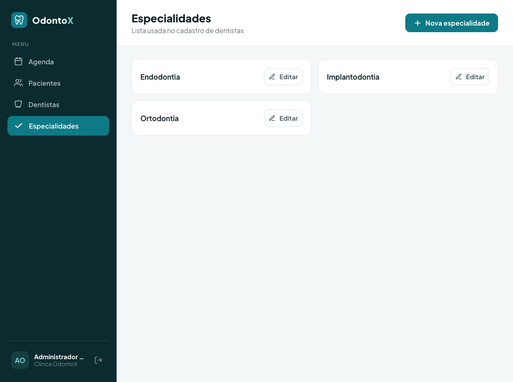
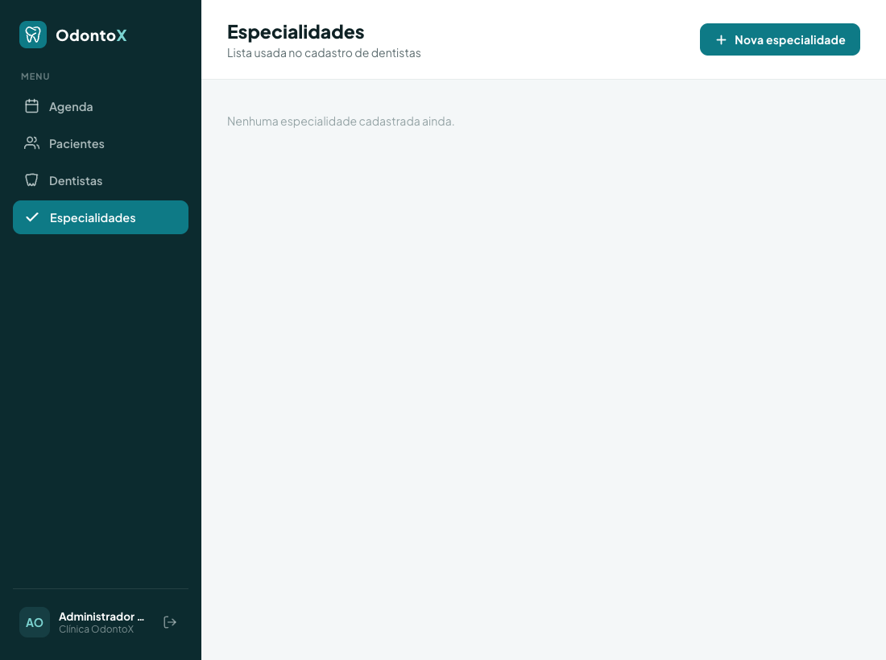
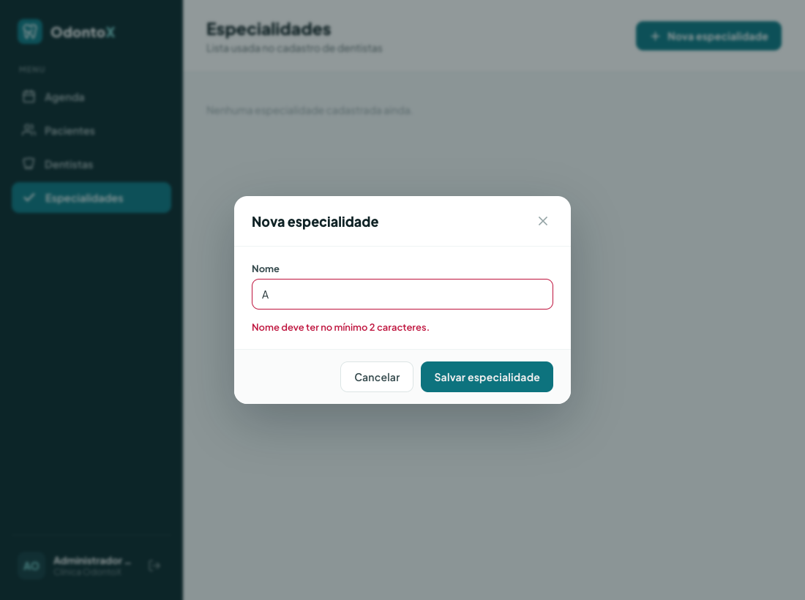
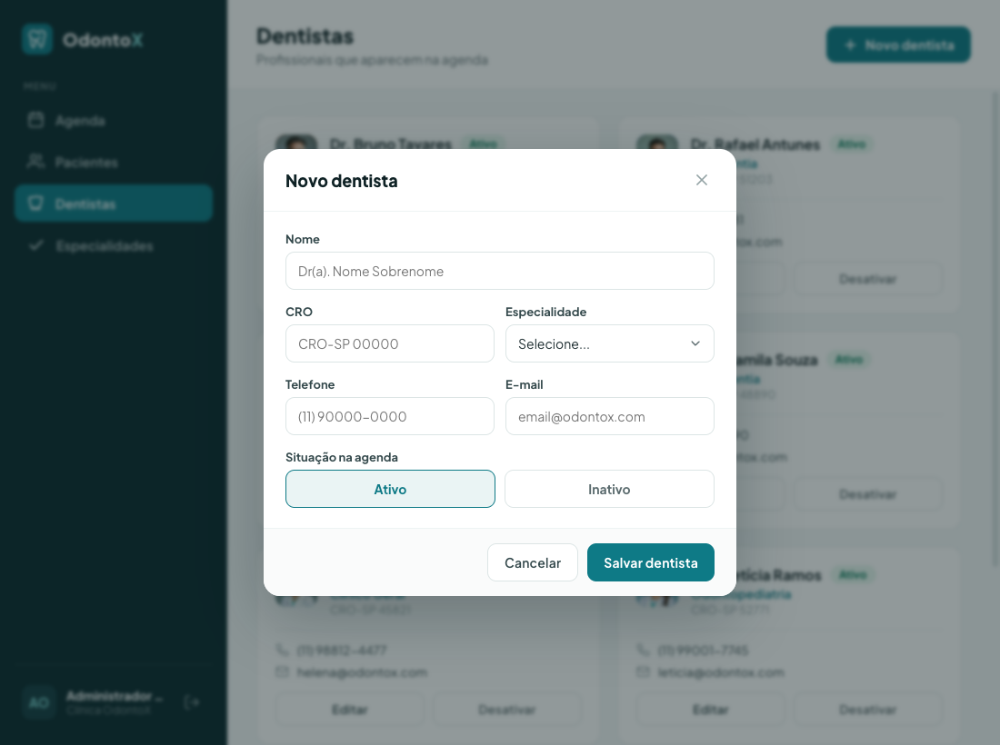
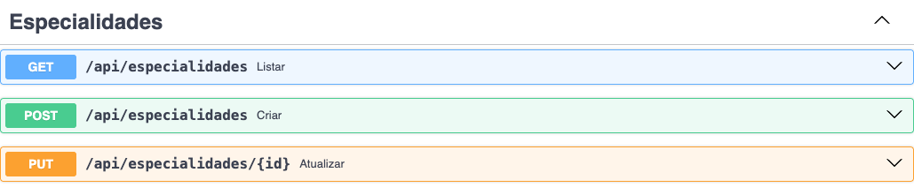

# Tutorial Aluno 2 — CRUD de Especialidades Odontológicas + Select no Cadastro de Dentista

Este tutorial é um passo a passo COMPLETO. Foi escrito para quem está com dificuldade. Não pule nenhum passo. Se você seguir tudo ao pé da letra, no final terá a feature funcionando ponta a ponta (ou seja: do banco de dados até a tela — o "backend", que é a parte que roda no servidor e guarda os dados, e o "frontend", que é a tela que você vê no navegador).

---

## Setup — preparando o computador do zero

Antes de programar qualquer coisa, você precisa deixar o projeto rodando na sua máquina. Esta seção é independente: se você nunca instalou nada disso, siga na ordem. Se já tem algo instalado, só confira a versão. Não pule — quase todo problema no fim do tutorial vem de um passo de setup que ficou pela metade.

### 1. Instalar os programas necessários

Você vai precisar de quatro programas. Instale cada um e depois confira se ficou tudo certo.

- **Git** — guarda o histórico do código e baixa o projeto. Baixe em <https://git-scm.com/downloads>.
- **Python 3.11 ou mais novo** — a linguagem do backend. Baixe em <https://www.python.org/downloads/>. Atenção: pegue a versão **3.11** (ou 3.12/3.13, se existir). NÃO precisa ser exatamente a versão que o projeto sugere — veja o aviso no passo 3.
- **Bun** — é o que instala as bibliotecas do frontend e roda a tela. Pense nele como um "ajudante" que baixa tudo que o site precisa e liga o servidor de desenvolvimento. Instale seguindo <https://bun.sh>. (Neste projeto NÃO usamos `npm`; o programa oficial é o Bun.)
- **VSCode** — o editor de código onde você vai escrever tudo. Baixe em <https://code.visualstudio.com>.

Depois de instalar, abra um terminal e confira as versões. Se cada comando responder com um número de versão, está funcionando:

```bash
git --version
python --version
bun --version
```

> Por que conferir? Porque se um desses não responder, o problema é de instalação — e é muito mais fácil resolver isso agora do que descobrir lá na frente que "nada funciona".

### 2. Baixar o projeto (clonar o repositório)

"Clonar" é só o nome técnico de baixar uma cópia completa do projeto, com todo o histórico, para o seu computador. Rode:

```bash
git clone https://github.com/matheuscostabeber/odontox.git
```

Isso cria uma pasta `odontox`. Tudo daqui pra frente acontece dentro dela. O projeto tem duas partes: a pasta `backend/` (servidor) e a pasta `frontend/` (tela).

### 3. Preparar o backend

O backend precisa de um "ambiente isolado" de Python, chamado **venv** (de *virtual environment*, ambiente virtual). Ele é uma caixinha separada onde as bibliotecas do projeto ficam, sem bagunçar o Python do resto do seu computador. Por que isso importa? Porque cada projeto pode precisar de versões diferentes das mesmas bibliotecas — o venv evita que um projeto atrapalhe o outro.

> Aviso importante: o projeto tem um arquivo chamado `.python-version` que pode pedir o Python `3.14`. Essa versão talvez nem exista ainda na sua máquina. Se der erro ao criar o venv, force o Python 3.11 no comando (`python3.11 -m venv .venv`). Funciona igual.

Entre na pasta do backend e crie o venv:

```bash
cd odontox/backend
python -m venv .venv
```

Agora **ative** o venv (isso "liga" a caixinha; você verá `(.venv)` no início da linha do terminal):

- No macOS/Linux:

```bash
source .venv/bin/activate
```

- No Windows (PowerShell):

```bash
.venv\Scripts\Activate.ps1
```

Com o venv ativo, instale as bibliotecas que o projeto usa:

```bash
pip install -r requirements.txt
```

### 4. Preparar o frontend

Em OUTRO terminal, entre na pasta do frontend e instale as bibliotecas com o Bun:

```bash
cd odontox/frontend
bun install
```

### 5. Rodar tudo

Você vai deixar dois terminais abertos ao mesmo tempo: um para o backend, outro para o frontend.

- **Terminal do backend** (na pasta `backend/`, com o venv ativo):

```bash
.venv/bin/python main.py
```

- **Terminal do frontend** (na pasta `frontend/`):

```bash
bun run dev
```

Abra o navegador no endereço que o frontend mostrar (normalmente `http://localhost:5180`) e faça login. Se a tela abrir, o setup está completo.

### 6. Criar uma branch para o seu trabalho

Antes de começar a mexer no código, crie uma **branch** (uma "linha de trabalho" separada). Por que? Porque assim você mexe à vontade sem bagunçar a versão principal do projeto. Se algo der errado, é fácil voltar atrás, e seu trabalho fica organizado num lugar só. Rode (na pasta `odontox`):

```bash
git checkout -b minha-feature
```

A partir daqui você está na sua própria branch. Pode programar tranquilo.

### 7. Instalar as extensões do VSCode

Extensões deixam o editor mais esperto (avisam de erros, colorem o código, completam o que você digita). Abra o VSCode, vá no ícone de extensões (na barra lateral) e instale estas:

- **Python** — suporte básico para escrever e rodar Python.
- **Pylance** — autocompletar inteligente e avisos de erro no Python.
- **Python Debugger** — permite pausar o programa e investigar passo a passo.
- **Python Environments** — ajuda a escolher e gerenciar o venv certo dentro do editor.
- **ESLint** — aponta erros e mau cheiro no código do frontend (JavaScript/TypeScript).
- **SQLite3 Editor** — abre e visualiza o banco de dados SQLite direto no editor.
- **vscode-icons** — coloca ícones nos arquivos, fica mais fácil achar as coisas.
- **HTML CSS Support** — autocompletar para HTML e CSS.

Pronto. Com o setup feito e os dois servidores rodando, siga para o tutorial.

---

Este tutorial é um passo a passo COMPLETO. Foi escrito para quem está com dificuldade. Não pule nenhum passo. Se você seguir tudo ao pé da letra, no final terá a feature funcionando ponta a ponta (backend + frontend).

> Dica de ouro: faça **um arquivo de cada vez**, na ordem em que eles aparecem aqui. Não tente fazer tudo junto. A cada arquivo concluído, salve. No final tem uma seção "Como testar" e um "Checklist".

---

## O que você vai construir

Você vai criar uma coisa nova chamada **Especialidade** (com um único dado: o `nome`). Ela é uma "tabela de apoio": serve só para alimentar uma lista de opções. Hoje, quando você cadastra um dentista, o campo "Especialidade" é um texto livre — o usuário digita o que quiser (e pode errar a grafia, escrever de jeitos diferentes, etc). Depois deste tutorial, esse campo vira um **select** (uma caixa de seleção, em que você escolhe de uma lista pronta) com as especialidades já cadastradas. Você vai copiar EXATAMENTE o mesmo padrão que o projeto já usa para "Dentista", camada por camada. No backend: SQL puro (os comandos que falam com o banco de dados), repositório, model, DTO de entrada, DTO de resposta, rota protegida e o registro de tudo isso na inicialização do programa. No frontend: o tipo em TypeScript, a função que chama a API, a ação que guarda o estado, uma página nova de cadastro, uma rota e um item no menu. Não se preocupe com esses nomes agora — cada um é explicado quando aparece pela primeira vez.

No final, você terá:

- Uma tabela `especialidade` no banco SQLite, criada sozinha quando o backend liga.
- Endpoints REST (endpoint é cada "endereço" da API que o frontend chama para pedir ou enviar dados): `GET/POST/PUT /api/especialidades` — a lista também volta junto em `GET /api/clinica/dados`.
- Uma página `/especialidades` no site, com a lista e uma janela (modal) para cadastrar e editar.
- Um item "Especialidades" no menu lateral.
- O campo "Especialidade" da janela de dentista virando um `<select>` com as opções vindas do backend.

Veja o resultado final do CRUD de especialidades funcionando (CRUD é a sigla, em inglês, para as quatro operações básicas de um cadastro: Criar, Ler, Atualizar e Apagar — aqui vamos usar Criar, Ler e Atualizar):



---

## Pré-requisitos

Esta é a versão rápida do setup, para você ter os dois servidores rodando enquanto programa. Se você já fez a seção "Setup" acima, é só conferir. Abra dois terminais (duas janelas de terminal) — um fica com o backend, outro com o frontend.

**Terminal 1 — Backend** (rodar a partir da pasta `backend/`):

```bash
cd /Volumes/Externo/Ifes/2026.1/PI20261/Projetos/odontox/backend
.venv/bin/python main.py
```

O backend sobe na porta `8400` (padrão de dev). A documentação interativa fica em `http://localhost:8400/docs`. Use sempre o Python do venv (`.venv/bin/python`), nunca o Python global.

**Terminal 2 — Frontend** (rodar a partir da pasta `frontend/`):

```bash
cd /Volumes/Externo/Ifes/2026.1/PI20261/Projetos/odontox/frontend
bun run dev
```

O Vite (a ferramenta que monta e serve a tela) sobe na porta `5180`. Ele redireciona tudo que começa com `/api` para o backend, então o navegador "enxerga" os dois como se fossem o mesmo site (por isso não há problema de CORS — aquele bloqueio que o navegador faz quando um site tenta chamar outro de endereço diferente). Abra `http://localhost:5180` e faça login com o usuário de exemplo já criado no banco (`odontox@ifes.site`).

Para conferir se os tipos do frontend estão certos sem precisar gerar o site inteiro:

```bash
bunx tsc -b --noEmit
```

Deixe os dois terminais rodando. O backend recarrega sozinho quando você salva um arquivo, e o Vite atualiza a tela na hora — então, na maioria das vezes, as mudanças aparecem sozinhas. Mas quando você mexe em `main.py` ou cria arquivos novos no backend, às vezes é preciso parar (Ctrl+C) e subir de novo.

---

## As camadas e a ordem de implementação

O projeto é organizado em camadas (cada parte tem uma função bem definida). Vamos construir **de baixo para cima**: começamos pelo banco de dados e subimos até a tela. Essa ordem importa porque cada camada usa a anterior — se você começar pela tela, ela não vai ter nada para chamar, e nada funciona.

Ordem que vamos seguir:

**Backend**
1. `backend/sql/especialidade_sql.py` — as queries SQL (NOVO).
2. `backend/model/especialidade_model.py` — o model de domínio (NOVO).
3. `backend/repo/especialidade_repo.py` — o repositório (NOVO).
4. `backend/dtos/especialidade_dto.py` — DTO de entrada (NOVO).
5. `backend/dtos/responses/especialidade_response.py` — DTO de saída (NOVO).
6. `backend/routes/especialidade_routes.py` — o router REST (NOVO).
7. `backend/main.py` — registrar a tabela no startup e registrar o router (EDIÇÃO). **Passo que mais se erra.**
8. `backend/routes/clinica_routes.py` — incluir a lista no agregador (EDIÇÃO).

**Frontend**
9. `frontend/src/lib/types.ts` — o tipo `Especialidade` (EDIÇÃO).
10. `frontend/src/lib/odontox/clinicaApi.ts` — `DadosClinica` + funções da API (EDIÇÃO).
11. `frontend/src/context/ClinicContext.tsx` — estado + ação `saveEspecialidade` (EDIÇÃO).
12. `frontend/src/pages/odontox/EspecialidadesPage.tsx` — a página (NOVO).
13. `frontend/src/components/odontox/modals/EspecialidadeFormModal.tsx` — o modal de form (NOVO).
14. `frontend/src/components/odontox/modals/ModalRoot.tsx` — registrar o modal (EDIÇÃO).
15. `frontend/src/router.tsx` — registrar a rota `/especialidades` (EDIÇÃO).
16. `frontend/src/components/odontox/Sidebar.tsx` — item no menu (EDIÇÃO).
17. `frontend/src/components/odontox/modals/DentistFormModal.tsx` — trocar o TextInput por um `<Select>` (EDIÇÃO).

> Por que essa ordem? O frontend (passos 9 em diante) só funciona se o backend já estiver devolvendo os dados certos. E, dentro do backend, a rota (passo 6) precisa do repositório, do model e dos DTOs já prontos. Por isso começamos pelo SQL e subimos.

---

## Parte 1 — Backend

### 1. `backend/sql/especialidade_sql.py` — ARQUIVO NOVO

Aqui ficam os comandos SQL (as instruções que falam direto com o banco de dados) guardados como textos fixos, um para cada operação. O projeto não usa nenhuma "mágica" que escreve SQL por você — o SQL é escrito à mão mesmo. Este arquivo copia o `dentista_sql.py`, mas com só um dado (`nome`). Como é uma tabela de apoio bem simples, não temos campo `ativo` nem botão de ligar/desligar, e também não temos `DELETE` (apagar). Vamos fazer o mesmo conjunto de operações do dentista: criar a tabela, inserir, pegar todos, pegar por id e atualizar.

```python
CRIAR_TABELA = """
CREATE TABLE IF NOT EXISTS especialidade (
    id INTEGER PRIMARY KEY AUTOINCREMENT,
    nome TEXT NOT NULL
)
"""

INSERIR = """
INSERT INTO especialidade (nome)
VALUES (?)
"""

OBTER_TODOS = """
SELECT id, nome
FROM especialidade
ORDER BY nome
"""

OBTER_POR_ID = """
SELECT id, nome
FROM especialidade
WHERE id = ?
"""

ATUALIZAR = """
UPDATE especialidade
SET nome = ?
WHERE id = ?
"""
```

Pontos importantes:
- `CREATE TABLE IF NOT EXISTS` — o "IF NOT EXISTS" quer dizer "só crie se ainda não existir". Assim não dá erro mesmo rodando toda vez que o backend liga.
- `id INTEGER PRIMARY KEY AUTOINCREMENT` — o `id` é o número que identifica cada linha, e o próprio banco gera esse número sozinho (você não precisa inventar).
- Os `?` são lugares reservados para os valores (o nome técnico é *placeholder*). NUNCA monte o texto do SQL grudando os valores do usuário direto nele — isso abre uma brecha perigosa de segurança chamada SQL injection, em que alguém mal-intencionado consegue rodar comandos no seu banco. Em vez disso, o repositório manda os valores separados, numa tupla, e o banco encaixa nos `?` com segurança.
- `ORDER BY nome` deixa a lista em ordem alfabética por nome (igual ao de dentista).

### 2. `backend/model/especialidade_model.py` — ARQUIVO NOVO

O **model** é a forma como a Especialidade existe dentro do programa: uma classe simples só para carregar os dados (`@dataclass`), com os nomes dos campos em `snake_case` (o estilo de escrever tudo minúsculo, separando palavras por underline, que é o padrão do Python). Copia o `dentista_model.py`, mas só com `id` e `nome`.

```python
from dataclasses import dataclass


@dataclass
class Especialidade:
    id: int
    nome: str
```

Pontos importantes:
- É só um pacotinho de dados, sem nenhuma lógica. O repositório transforma cada linha que vem do banco numa Especialidade dessas.
- Repare que não usamos `Optional` aqui (que serviria para dizer "este campo pode estar vazio"), porque `id` e `nome` estão sempre preenchidos.

### 3. `backend/repo/especialidade_repo.py` — ARQUIVO NOVO

O **repositório** é o arquivo que junta todas as funções que conversam com o banco de dados. São funções soltas no arquivo (não estão dentro de uma classe). Cada uma abre a conexão usando o `obter_conexao()`, que cuida do trabalho chato por você: se tudo der certo, ele salva as mudanças (faz o *commit*); se der erro no meio, ele desfaz tudo (faz o *rollback*), pra não deixar o banco pela metade. E todas usam aqueles `?` seguros do passo anterior. Copia o `dentista_repo.py`.

```python
"""Repositório de Especialidades."""

import sqlite3
from typing import Optional

from model.especialidade_model import Especialidade
from sql.especialidade_sql import (
    CRIAR_TABELA,
    INSERIR,
    OBTER_TODOS,
    OBTER_POR_ID,
    ATUALIZAR,
)
from util.db_util import obter_conexao
from util.logger_config import logger


def _row_to_especialidade(row: sqlite3.Row) -> Especialidade:
    return Especialidade(
        id=row["id"],
        nome=row["nome"],
    )


def criar_tabela() -> bool:
    with obter_conexao() as conn:
        cursor = conn.cursor()
        cursor.execute(CRIAR_TABELA)
        return True


def inserir(especialidade: Especialidade) -> Optional[int]:
    with obter_conexao() as conn:
        cursor = conn.cursor()
        cursor.execute(INSERIR, (
            especialidade.nome,
        ))
        return cursor.lastrowid


def obter_todos() -> list[Especialidade]:
    with obter_conexao() as conn:
        cursor = conn.cursor()
        cursor.execute(OBTER_TODOS)
        rows = cursor.fetchall()
        return [_row_to_especialidade(row) for row in rows]


def obter_por_id(id: int) -> Optional[Especialidade]:
    with obter_conexao() as conn:
        cursor = conn.cursor()
        cursor.execute(OBTER_POR_ID, (id,))
        row = cursor.fetchone()
        if row:
            return _row_to_especialidade(row)
        return None


def atualizar(especialidade: Especialidade) -> bool:
    with obter_conexao() as conn:
        cursor = conn.cursor()
        cursor.execute(ATUALIZAR, (
            especialidade.nome,
            especialidade.id,
        ))
        return cursor.rowcount > 0
```

Pontos importantes:
- `_row_to_especialidade(row)` (o underline na frente é só uma convenção para dizer "esta função é de uso interno") pega uma linha do banco e a transforma numa Especialidade. Toda parte do projeto tem uma função assim.
- `inserir(...)` devolve `cursor.lastrowid`, que é o `id` novo que o banco acabou de gerar.
- `obter_todos()` devolve uma lista de Especialidades; `obter_por_id(id)` devolve uma Especialidade ou `None` (nada), caso não exista nenhuma com aquele id.
- `atualizar(...)` devolve `True` se realmente mudou alguma linha (`cursor.rowcount > 0`).
- A vírgula em `(especialidade.nome,)` é OBRIGATÓRIA. Sem ela, `(x)` é só um parêntese em volta do valor — não é uma tupla (uma listinha fixa de valores). E o `execute` exige uma tupla. É um erro fácil de cometer e difícil de enxergar.
- `criar_tabela()` é a função que o `main.py` vai chamar quando o backend ligar. **Ela TEM que existir com esse nome exato**, senão o registro da tabela na inicialização quebra.
- Importamos o `logger` (que serve para registrar mensagens de log) só para manter o mesmo padrão dos outros repositórios — aqui a gente nem chega a usar, mas é o estilo do projeto.

### 4. `backend/dtos/especialidade_dto.py` — ARQUIVO NOVO

DTO quer dizer "objeto de transferência de dados" (do inglês *Data Transfer Object*). É só um molde que descreve o formato dos dados que vão de um lado para o outro. O **DTO de entrada** descreve o JSON (o formato de texto em que o frontend manda os dados) que chega quando alguém cadastra ou edita uma especialidade. Aqui é onde a gente confere se o `nome` é válido. Para isso, reusamos uma checagem pronta, `validar_string_obrigatoria`, que mora em `dtos/validators.py` (o `PacienteDTO` faz igualzinho).

```python
from pydantic import BaseModel, Field, field_validator

from dtos.validators import validar_string_obrigatoria


class EspecialidadeDTO(BaseModel):
    """DTO para criação/edição de especialidade."""

    nome: str = Field(..., description="Nome da especialidade")

    _validar_nome = field_validator("nome")(
        validar_string_obrigatoria(nome_campo="Nome", tamanho_minimo=2, tamanho_maximo=100)
    )
```

Pontos importantes:
- Em `nome: str = Field(..., ...)`, os três pontos (`...`) querem dizer "este campo é obrigatório".
- A checagem dispara um erro se o nome for inválido. O FastAPI (a ferramenta do backend) pega esse erro sozinho e devolve uma resposta com o código **422** (que é o número que significa "você me mandou dados inválidos"), já no formato de erro que o projeto usa. Você não precisa escrever nada disso na rota — acontece automático.
- O nome do campo (`nome`) tem que ser EXATAMENTE igual ao que o frontend manda. O frontend envia `{ nome: '...' }`, então bate certinho.
- O projeto costuma colocar um underline na frente do nome da checagem (`_validar_nome`).

### 5. `backend/dtos/responses/especialidade_response.py` — ARQUIVO NOVO

O **DTO de resposta** descreve o JSON que a API DEVOLVE (o formato dos dados que o backend manda de volta para a tela). Ele tem uma função que monta a resposta a partir do model. É aqui que, se houvesse campos escritos no estilo do Python (com underline, tipo `foto_url`), a gente os traduziria para o estilo do JavaScript (sem underline, tipo `fotoUrl` — como acontece no dentista). Como aqui só temos `id` e `nome`, não há nada para traduzir. Copia o `dentista_response.py`.

```python
"""Schemas de resposta do módulo de especialidades."""
from pydantic import BaseModel

from model.especialidade_model import Especialidade


class EspecialidadeResponse(BaseModel):
    """Representação de uma especialidade."""

    id: int
    nome: str

    @classmethod
    def de_especialidade(cls, especialidade: Especialidade) -> "EspecialidadeResponse":
        """Constrói o response a partir da entidade de domínio."""
        return cls(
            id=especialidade.id,
            nome=especialidade.nome,
        )
```

Pontos importantes:
- A função se chama `de_especialidade` (o padrão é `de_<nome da coisa>`, igual ao `de_dentista`).
- Esse Response é o "combinado" com o frontend: o tipo `Especialidade` em TypeScript (passo 9) precisa ter os mesmos campos (`id`, `nome`). Se um lado tiver um campo que o outro não tem, as coisas param de bater.

### 6. `backend/routes/especialidade_routes.py` — ARQUIVO NOVO

O **router** é o arquivo que cria os endpoints REST (lembra: cada endpoint é um endereço da API que o frontend chama). Copia o `dentista_routes.py`, mas SEM o ligar/desligar (especialidade não tem campo `ativo`). Cada função de rota usa `async def` (porque ela espera respostas que demoram, sem travar o resto), recebe `request: Request` como primeiro parâmetro, termina com `usuario_logado: Optional[UsuarioLogado] = None`, e tem o `@requer_autenticacao()` logo abaixo da linha que define a rota.

```python
"""
Rotas para gerenciamento de especialidades odontológicas (API JSON).

Permite que usuários logados:
- Listem especialidades
- Cadastrem novas especialidades
- Editem especialidades
"""

# =============================================================================
# Imports
# =============================================================================

# Standard library
from typing import Optional

# Third-party
from fastapi import APIRouter, HTTPException, Request, status

# DTOs (entrada)
from dtos.especialidade_dto import EspecialidadeDTO

# Schemas (saída)
from dtos.responses.especialidade_response import EspecialidadeResponse

# Models
from model.especialidade_model import Especialidade
from model.usuario_logado_model import UsuarioLogado

# Repositories
from repo import especialidade_repo

# Utilities
from util.auth_decorator import requer_autenticacao
from util.logger_config import logger

# =============================================================================
# Configuração do Router
# =============================================================================

router = APIRouter(prefix="/especialidades")


# =============================================================================
# Listagem
# =============================================================================

@router.get("", response_model=list[EspecialidadeResponse])
@requer_autenticacao()
async def listar(
    request: Request,
    usuario_logado: Optional[UsuarioLogado] = None,
):
    """Lista todas as especialidades (ordenadas por nome)."""
    assert usuario_logado is not None
    especialidades = especialidade_repo.obter_todos()
    return [EspecialidadeResponse.de_especialidade(e) for e in especialidades]


# =============================================================================
# Criação
# =============================================================================

@router.post(
    "",
    response_model=EspecialidadeResponse,
    status_code=status.HTTP_201_CREATED,
)
@requer_autenticacao()
async def criar(
    request: Request,
    dto: EspecialidadeDTO,
    usuario_logado: Optional[UsuarioLogado] = None,
):
    """Cadastra uma nova especialidade."""
    assert usuario_logado is not None

    especialidade = Especialidade(
        id=0,
        nome=dto.nome,
    )
    especialidade_id = especialidade_repo.inserir(especialidade)
    if not especialidade_id:
        raise HTTPException(
            status_code=status.HTTP_500_INTERNAL_SERVER_ERROR,
            detail="Erro ao cadastrar a especialidade. Tente novamente.",
        )

    logger.info(f"Especialidade #{especialidade_id} '{dto.nome}' criada por usuário {usuario_logado.id}")

    criada = especialidade_repo.obter_por_id(especialidade_id)
    return EspecialidadeResponse.de_especialidade(criada)


# =============================================================================
# Edição
# =============================================================================

@router.put("/{id}", response_model=EspecialidadeResponse)
@requer_autenticacao()
async def atualizar(
    request: Request,
    id: int,
    dto: EspecialidadeDTO,
    usuario_logado: Optional[UsuarioLogado] = None,
):
    """Atualiza uma especialidade existente."""
    assert usuario_logado is not None

    existente = especialidade_repo.obter_por_id(id)
    if not existente:
        raise HTTPException(
            status_code=status.HTTP_404_NOT_FOUND,
            detail="Especialidade não encontrada.",
        )

    especialidade = Especialidade(
        id=id,
        nome=dto.nome,
    )
    especialidade_repo.atualizar(especialidade)

    logger.info(f"Especialidade #{id} atualizada por usuário {usuario_logado.id}")

    atualizada = especialidade_repo.obter_por_id(id)
    return EspecialidadeResponse.de_especialidade(atualizada)
```

Pontos importantes:
- Em `router = APIRouter(prefix="/especialidades")`, o prefixo é SEM `/api`. É o `main.py` que coloca o `/api` na frente depois. O endereço final fica `/api/especialidades`.
- `@requer_autenticacao()` fica ABAIXO de `@router.get/post/put`. Ele exige que o usuário esteja logado (devolve 401, "não autorizado", se for um anônimo) e entrega o `usuario_logado` para a função. Por isso, dentro da função, esse valor já chega preenchido, e usamos `assert usuario_logado is not None` só para o verificador de tipos do editor ficar tranquilo.
- Quando algo dá errado, sempre sinalize com `raise HTTPException(status_code=..., detail="...")`. Use 404 ("não encontrado") quando o recurso não existe e 500 ("erro do servidor") quando o repositório falha. O projeto pega esses erros automaticamente e os entrega no formato padrão `{detail, type, errors}`.
- No POST, criamos o model com `id=0` (porque o banco é quem vai gerar o id de verdade); depois lemos de volta com `obter_por_id` para devolver os dados já com o id certo.
- No PUT, primeiro checamos se a especialidade existe (404 se não), depois atualizamos e lemos de novo.
- A checagem do `nome` (que pode gerar o 422) já acontece sozinha por causa do DTO; você não escreve nada para isso aqui na rota.

### 7. `backend/main.py` — EDIÇÃO (passo crítico!)

Este é o passo que mais gente esquece. Sem ele, a tabela não é criada e a rota nem existe — e aí parece que "nada funciona", mesmo com todos os arquivos certos. São **quatro mudanças** neste arquivo. Vá com calma e confira uma por uma.

**Mudança 7.1 — importar o repo novo.** Procure o bloco de imports de repositórios (começa em `from repo import (`):

Antes:

```python
from repo import (
    usuario_repo,
    configuracao_repo,
    indices_repo,
    dentista_repo,
    paciente_repo,
    consulta_repo,
    atendimento_repo,
)
```

Depois (adicione `especialidade_repo` na lista):

```python
from repo import (
    usuario_repo,
    configuracao_repo,
    indices_repo,
    dentista_repo,
    especialidade_repo,
    paciente_repo,
    consulta_repo,
    atendimento_repo,
)
```

**Mudança 7.2 — importar o router novo.** Procure os imports de rotas (linhas `from routes.X_routes import router as X_router`). Adicione abaixo da linha do `dentista_router`:

```python
from routes.dentista_routes import router as dentista_router
from routes.especialidade_routes import router as especialidade_router
from routes.paciente_routes import router as paciente_router
```

**Mudança 7.3 — registrar a tabela no startup.** Procure a lista `TABELAS = [`. Adicione a tupla `(especialidade_repo, "especialidade")`:

Antes:

```python
TABELAS = [
    (usuario_repo, "usuario"),
    (configuracao_repo, "configuracao"),
    (dentista_repo, "dentista"),
    (paciente_repo, "paciente"),
    (consulta_repo, "consulta"),
    (atendimento_repo, "atendimento"),
]
```

Depois:

```python
TABELAS = [
    (usuario_repo, "usuario"),
    (configuracao_repo, "configuracao"),
    (dentista_repo, "dentista"),
    (especialidade_repo, "especialidade"),
    (paciente_repo, "paciente"),
    (consulta_repo, "consulta"),
    (atendimento_repo, "atendimento"),
]
```

> O trecho logo abaixo (`for repo, nome in TABELAS: repo.criar_tabela()`) passa por cada item da lista e cria a tabela quando o backend liga. É por isso que o repositório PRECISA ter a função `criar_tabela()` (passo 3) — é ela que esse trecho chama.

**Mudança 7.4 — registrar o router.** Procure a lista `ROUTERS = [`. Adicione a tupla do router de especialidades (logo após a de dentistas):

Antes:

```python
ROUTERS = [
    (auth_router, ["Autenticação"], "autenticação"),
    (usuario_router, ["Usuário"], "usuário"),
    (clinica_router, ["Clinica"], "clinica"),
    (dentista_router, ["Dentistas"], "dentistas"),
    (paciente_router, ["Pacientes"], "pacientes"),
    (consulta_router, ["Consultas"], "consultas"),
    (atendimento_router, ["Atendimentos"], "atendimentos"),
]
```

Depois:

```python
ROUTERS = [
    (auth_router, ["Autenticação"], "autenticação"),
    (usuario_router, ["Usuário"], "usuário"),
    (clinica_router, ["Clinica"], "clinica"),
    (dentista_router, ["Dentistas"], "dentistas"),
    (especialidade_router, ["Especialidades"], "especialidades"),
    (paciente_router, ["Pacientes"], "pacientes"),
    (consulta_router, ["Consultas"], "consultas"),
    (atendimento_router, ["Atendimentos"], "atendimentos"),
]
```

> O trecho `for router, tags, nome in ROUTERS: app.include_router(router, prefix=API_PREFIX, ...)` registra todas as rotas sob `/api`. É aqui que `/especialidades` finalmente vira `/api/especialidades`.

**Reinicie o backend** (Ctrl+C no Terminal 1 e rode `.venv/bin/python main.py` de novo). Olhe as mensagens: devem aparecer `Tabela 'especialidade' criada/verificada` e `Router de especialidades incluído em /api`. Se aparecer um erro de import (de algo que não foi encontrado), volte e releia os passos 7.1 e 7.2 — provavelmente um nome ficou diferente.

### 8. `backend/routes/clinica_routes.py` — EDIÇÃO

Existe um endpoint que junta tudo: o `GET /clinica/dados` devolve dentistas, pacientes, consultas etc. de uma vez só, logo que o site abre (SPA é o nome desse tipo de site que carrega uma vez e vai trocando as telas sem recarregar a página). Vamos incluir a lista de especialidades nesse pacote, para o frontend já receber as opções junto com o resto, sem precisar de uma chamada extra. São **três mudanças** neste arquivo.

**Mudança 8.1 — importar o Response.** No bloco de imports de schemas de saída, adicione:

```python
# Schemas (saída)
from dtos.responses.dentista_response import DentistaResponse
from dtos.responses.especialidade_response import EspecialidadeResponse
from dtos.responses.paciente_response import PacienteResponse
from dtos.responses.consulta_response import ConsultaResponse
from dtos.responses.atendimento_response import AtendimentoResponse
```

**Mudança 8.2 — importar o repo.** No bloco `from repo import (`, adicione `especialidade_repo`:

```python
from repo import (
    dentista_repo,
    especialidade_repo,
    paciente_repo,
    consulta_repo,
    atendimento_repo,
)
```

**Mudança 8.3 — incluir a lista no retorno.** Dentro da função `dados`, no dicionário retornado, adicione a chave `especialidades`:

```python
    return {
        "dentists": [
            DentistaResponse.de_dentista(d) for d in dentista_repo.obter_todos()
        ],
        "especialidades": [
            EspecialidadeResponse.de_especialidade(e) for e in especialidade_repo.obter_todos()
        ],
        "patients": [
            PacienteResponse.de_paciente(p) for p in paciente_repo.obter_todos()
        ],
        "consultas": [
            ConsultaResponse.de_consulta(c) for c in consulta_repo.obter_todos()
        ],
        "atendimentos": [
            AtendimentoResponse.de_atendimento(a)
            for a in atendimento_repo.obter_todos()
        ],
    }
```

Pontos importantes:
- A chave do JSON é `"especialidades"` (plural, tudo minúsculo). O frontend (passo 10) vai procurar exatamente por essa palavra. Se você escrever de um jeito num lado e diferente no outro, a lista nunca aparece.

**Teste rápido do backend** antes de ir para o frontend. Com o backend rodando e você logado no app pelo navegador (para ter o cookie de sessão, que é o que prova que você entrou), abra a documentação interativa em `http://localhost:8400/docs`: lá aparecem os novos endpoints `Especialidades`. Crie uma especialidade pelo POST e confira no GET que ela voltou.

---

## Parte 2 — Frontend

> Lembrete do projeto: **este projeto não usa Zod** (o Zod é uma biblioteca que valida dados no frontend; aqui ela não está em uso para a parte da clínica). Quem valida de verdade é o backend, que devolve 422 quando algo está errado. No frontend, você só confia no formato combinado. Não crie validação Zod para especialidade.

### 9. `frontend/src/lib/types.ts` — EDIÇÃO

Os tipos em TypeScript são a versão, no frontend, dos DTOs de resposta do backend — eles dizem ao editor qual é o formato dos dados que chegam. Vamos adicionar o tipo `Especialidade`. Coloque logo depois do `Dentista` (na seção "OdontoX — domínio da clínica").

```ts
export interface Especialidade {
  id: number
  nome: string
}
```

Pontos importantes:
- Os campos são os mesmos do `EspecialidadeResponse` do backend (`id`, `nome`).
- Não invente campos a mais; este tipo é o "combinado" com a API e tem que refletir exatamente o que ela devolve.

### 10. `frontend/src/lib/odontox/clinicaApi.ts` — EDIÇÃO

Aqui ficam as funções que de fato chamam a API pela internet (elas usam por baixo o cliente central `@/lib/api`, que cuida dos detalhes chatos da requisição). São **três mudanças**.

**Mudança 10.1 — importar o tipo.** Na linha de import de tipos, adicione `Especialidade`:

```ts
import type { Atendimento, Consulta, Dentista, Especialidade, Paciente, StatusConsulta } from '@/lib/types'
```

**Mudança 10.2 — incluir no `DadosClinica`.** A interface `DadosClinica` é a descrição, no frontend, do que o `GET /clinica/dados` devolve. Adicione a lista:

```ts
export interface DadosClinica {
  dentists: Dentista[]
  especialidades: Especialidade[]
  patients: Paciente[]
  consultas: Consulta[]
  atendimentos: Atendimento[]
}
```

> O nome `especialidades` aqui tem que ser IGUAL à chave que o backend usa no JSON (passo 8.3). Mesma palavra, mesma grafia.

**Mudança 10.3 — adicionar as funções da API.** Dentro do objeto `clinicaApi`, adicione um bloco de especialidades (pode colocar logo depois do bloco de dentistas):

```ts
  // ---- especialidades ----
  createEspecialidade: (f: Partial<Especialidade>) => api.post<Especialidade>('/especialidades', f),
  updateEspecialidade: (id: number, f: Partial<Especialidade>) => api.put<Especialidade>('/especialidades/' + id, f),
```

Pontos importantes:
- Os caminhos não levam o `/api` na frente (escreva só `/especialidades`, e não `/api/especialidades`). O cliente central coloca o `/api`, o cookie de sessão e o cabeçalho de segurança CSRF sozinho, em toda chamada.
- `api.post<Especialidade>` avisa ao editor que a resposta vai ser uma `Especialidade`. Isso vem direto do DTO de resposta do backend.

### 11. `frontend/src/context/ClinicContext.tsx` — EDIÇÃO

O "contexto" é uma área compartilhada de memória do frontend: ele chama o `GET /clinica/dados` assim que o site abre e guarda todas as listas ali. As páginas leem desse lugar (em vez de cada uma sair chamando a API por conta própria). Vamos fazer quatro coisas: (a) guardar `especialidades` na memória, (b) declarar a ação `saveEspecialidade`, (c) escrever essa ação, (d) deixá-la disponível para as páginas. São **quatro mudanças** (numeradas de 11.1 a 11.6, porque algumas têm subpassos).

**Mudança 11.1 — importar o tipo.** Na linha de import de tipos, adicione `Especialidade`:

```ts
import type { Atendimento, Consulta, Dentista, Especialidade, Paciente, StatusConsulta } from '@/lib/types'
```

**Mudança 11.2 — adicionar ao `ClinicData`.** Procure a interface `ClinicData` e adicione a lista:

```ts
interface ClinicData {
  dentists: Dentista[]
  especialidades: Especialidade[]
  patients: Paciente[]
  consultas: Consulta[]
  atendimentos: Atendimento[]
}
```

**Mudança 11.3 — declarar a ação.** Na interface `ClinicContextValue` (que lista tudo que o contexto oferece), adicione a assinatura da função (pode colocar perto de `saveDentist`):

```ts
  saveEspecialidade: (form: Partial<Especialidade> & { id?: number }) => Promise<void>
```

**Mudança 11.4 — inicializar o estado.** Procure o `useState<ClinicData>({ ... })` e adicione `especialidades: []`:

```ts
  const [data, setData] = useState<ClinicData>({ dentists: [], especialidades: [], patients: [], consultas: [], atendimentos: [] })
```

> Você NÃO precisa mexer no trecho que carrega os dados (`api.getAll()`). Como o backend agora já manda `especialidades` dentro de `/clinica/dados`, o `setData(d)` preenche a lista sozinho.

**Mudança 11.5 — implementar a ação.** Logo após o bloco `// ---- dentistas ----` (depois de `toggleDentist`), adicione:

```ts
  // ---- especialidades ----
  const saveEspecialidade = useCallback(async (form: Partial<Especialidade> & { id?: number }) => {
    if (form.id) {
      const updated = await api.updateEspecialidade(form.id, form)
      setData((d) => ({ ...d, especialidades: d.especialidades.map((x) => (x.id === form.id ? updated : x)) }))
    } else {
      const created = await api.createEspecialidade(form)
      setData((d) => ({ ...d, especialidades: [...d.especialidades, created] }))
    }
  }, [])
```

**Mudança 11.6 — deixar disponível no `value`.** Procure o objeto `const value: ClinicContextValue = { ... }` e adicione `saveEspecialidade` na lista (é isso que torna a função alcançável pelas páginas):

```ts
  const value: ClinicContextValue = {
    ...data,
    loading,
    dentist,
    patient,
    atendimentoFor,
    saveConsulta,
    setConsultaStatus,
    savePatient,
    saveDentist,
    toggleDentist,
    saveEspecialidade,
    saveAtendimento,
  }
```

Pontos importantes:
- A lógica de `saveEspecialidade` é igual à de `saveDentist`: se já tem `id`, é uma edição (faz PUT e troca o item na lista); se não tem, é um cadastro novo (faz POST e adiciona no fim). Em vez de mexer na lista antiga, criamos uma lista nova (com `map` e com o `[...]`) — esse jeito de "nunca alterar, sempre recriar" é o que o React espera para atualizar a tela direitinho.
- Como o `...data` está no `value`, a lista `especialidades` fica acessível para as páginas através do `useClinic()`.

### 12. `frontend/src/pages/odontox/EspecialidadesPage.tsx` — ARQUIVO NOVO

A página de cadastro (a tela com a lista e o botão de adicionar). Ela segue o padrão das outras páginas: exporta um componente com o mesmo nome do arquivo, os estilos vão escritos direto no JSX (inline), os dados vêm do `useClinic()` e a janela de cadastro é aberta pelo `useModal()`. É mais simples que a `DentistasPage`, porque a especialidade só tem o `nome`.

```tsx
import { useClinic } from '@/context/ClinicContext';
import { useModal } from '@/context/ModalContext';
import { Plus, Pencil } from '@/components/odontox/icons';
import Button from '@/components/odontox/Button';

export default function EspecialidadesPage() {
  const { especialidades } = useClinic();
  const { open } = useModal();

  return (
    <div style={{ display: 'flex', flexDirection: 'column', height: '100%', minHeight: 0 }}>
      <header style={{ padding: '24px 32px', background: '#fff', borderBottom: '1px solid #E6ECEC', flex: 'none', display: 'flex', alignItems: 'center', justifyContent: 'space-between', gap: 20 }}>
        <div>
          <h1 style={{ fontSize: 23, fontWeight: 800, margin: '0 0 3px', color: '#0F2225' }}>Especialidades</h1>
          <p style={{ fontSize: 14, color: '#5B6B6E', margin: 0 }}>Lista usada no cadastro de dentistas</p>
        </div>
        <Button onClick={() => open('especialidadeForm')}><Plus /> Nova especialidade</Button>
      </header>

      <div className="ox-scroll" style={{ flex: 1, overflow: 'auto', padding: '28px 32px' }}>
        {especialidades.length === 0 ? (
          <p style={{ fontSize: 14, color: '#94A3A5' }}>Nenhuma especialidade cadastrada ainda.</p>
        ) : (
          <div style={{ display: 'grid', gridTemplateColumns: 'repeat(auto-fill,minmax(280px,1fr))', gap: 14 }}>
            {especialidades.map((e) => (
              <div key={e.id} style={{ background: '#fff', border: '1px solid #E6ECEC', borderRadius: 14, padding: 18, display: 'flex', alignItems: 'center', justifyContent: 'space-between', gap: 12 }}>
                <span style={{ fontSize: 15, fontWeight: 700, color: '#1B2B2E' }}>{e.nome}</span>
                <Button variant="ghost" hoverDim={false} style={{ padding: 9, fontSize: 13.5 }} onClick={() => open('especialidadeForm', { entity: e })}><Pencil /> Editar</Button>
              </div>
            ))}
          </div>
        )}
      </div>
    </div>
  );
}
```

Pontos importantes:
- `const { especialidades } = useClinic();` — pega a lista direto do contexto, sem fazer uma chamada própria à API.
- `open('especialidadeForm')` abre a janela em modo "criar"; `open('especialidadeForm', { entity: e })` abre em modo "editar", já passando a especialidade clicada. O nome `'especialidadeForm'` é registrado no passo 14.
- Os ícones (`Plus`, `Pencil`) vêm de `@/components/odontox/icons`. Não use bibliotecas de ícone de fora.
- Os estilos vão escritos direto no código (inline); o projeto não usa Bootstrap nem nada parecido.

### 13. `frontend/src/components/odontox/modals/EspecialidadeFormModal.tsx` — ARQUIVO NOVO

A janela (modal) de cadastro e edição. Ela usa o `useForm` (um ajudante que controla os campos do formulário) e as peças prontas `Modal`, `ModalFooter` e `TextInput`. Copia o `DentistFormModal`, mas com um detalhe a mais: ela **trata o erro 422** do backend e mostra a mensagem ali mesmo, na própria janela, em vez de fechar do nada sem explicar o que houve.

```tsx
import { useState } from 'react';
import { useClinic } from '@/context/ClinicContext';
import { useModal } from '@/context/ModalContext';
import { useForm } from '@/hooks/useForm';
import { ApiError } from '@/lib/api';
import Modal from '@/components/odontox/Modal';
import ModalFooter from '@/components/odontox/ModalFooter';
import { TextInput } from '@/components/odontox/Field';
import type { Especialidade } from '@/lib/types';

export default function EspecialidadeFormModal({ entity }: { entity?: Especialidade }) {
  const { saveEspecialidade } = useClinic();
  const { close } = useModal();
  const [erro, setErro] = useState<string | null>(null);

  const { form, field } = useForm(
    entity
      ? { id: entity.id as number | undefined, nome: entity.nome }
      : { id: undefined as number | undefined, nome: '' }
  );

  const save = async () => {
    setErro(null);
    try {
      await saveEspecialidade(form);
      close();
    } catch (e) {
      // O backend valida o nome (mínimo 2 caracteres) e retorna 422 com a
      // mensagem no campo `errors.nome`. Mostramos inline em vez de fechar.
      if (e instanceof ApiError) {
        setErro(e.campo('nome') ?? e.message);
      } else {
        setErro('Não foi possível salvar a especialidade.');
      }
    }
  };

  return (
    <Modal onClose={close} maxWidth={460} title={entity ? 'Editar especialidade' : 'Nova especialidade'}>
      <div className="ox-scroll" style={{ padding: '22px 24px', display: 'flex', flexDirection: 'column', gap: 16, overflow: 'auto' }}>
        <TextInput
          label="Nome"
          placeholder="Ex.: Ortodontia"
          {...field('nome')}
          style={erro ? { border: '1px solid #BE123C' } : undefined}
        />
        {erro && (
          <p role="alert" style={{ margin: 0, color: '#BE123C', fontSize: 13, fontWeight: 600 }}>{erro}</p>
        )}
      </div>
      <ModalFooter onCancel={close} onSave={save} saveLabel="Salvar especialidade" />
    </Modal>
  );
}
```

Pontos importantes:
- `useForm(...)` recebe os valores iniciais do formulário. Se veio uma `entity` (edição), ele já começa preenchido; senão, começa vazio com `id: undefined` (ainda sem id).
- `{...field('nome')}` liga o campo de texto ao formulário (cuida do valor que aparece e do que muda quando você digita, sem você precisar escrever isso).
- `save()` é **assíncrono** (espera o backend responder): faz `await saveEspecialidade(form)` e só fecha a janela se deu certo. Se o backend recusar (por exemplo, nome com menos de 2 letras, que dá **422**), o `await` dispara um `ApiError` e o programa cai no `catch`.
- O `ApiError.campo('nome')` lê a primeira mensagem de erro do campo `nome` (que vem dentro do `errors`, no formato `{detail, type, errors}` do backend). É exatamente o texto **"Nome deve ter no mínimo 2 caracteres."** que aparece em vermelho embaixo do campo, com a borda dele também ficando vermelha.
- Cuidado com o estilo de erro: o `TextInput` já usa `border` (a forma curta, que junta cor, espessura e estilo). Por isso aqui também usamos `border: '1px solid #BE123C'` (forma curta) — se você misturar `borderColor` (forma separada) com `border`, o React reclama no console.
- `entity?: Especialidade` é opcional: sem ele, é criar; com ele, é editar.

### 14. `frontend/src/components/odontox/modals/ModalRoot.tsx` — EDIÇÃO

O `ModalRoot` é o "porteiro" das janelas: ele olha o `type` (o nome do modal que foi pedido) e decide qual janela mostrar. São **duas mudanças**.

**Mudança 14.1 — importar o modal.** Adicione o import junto dos outros:

```tsx
import DentistFormModal from './DentistFormModal';
import EspecialidadeFormModal from './EspecialidadeFormModal';
import AtendimentoFormModal from './AtendimentoFormModal';
```

**Mudança 14.2 — adicionar o caso.** Dentro do `switch (modal.type)` (que é uma lista de "se for tal nome, mostre tal janela"), adicione um caso novo (perto do `dentistForm`):

```tsx
    case 'dentistForm':
      return <DentistFormModal entity={modal.entity as never} />;
    case 'especialidadeForm':
      return <EspecialidadeFormModal entity={modal.entity as never} />;
```

Pontos importantes:
- O texto `'especialidadeForm'` tem que ser IGUAL ao que você usou no `open('especialidadeForm', ...)` da página (passo 12). Se digitar diferente em um dos lugares, a janela simplesmente não abre.
- `entity={modal.entity as never}` é igual ao que os outros modais já fazem; pode copiar sem medo.

### 15. `frontend/src/router.tsx` — EDIÇÃO

Registre a rota `/especialidades` dentro da área protegida por login (o "guard" é o porteiro que só deixa entrar quem está logado). São **duas mudanças**.

**Mudança 15.1 — importar a página.** Adicione junto dos outros imports de página:

```tsx
import DentistasPage from '@/pages/odontox/DentistasPage'
import EspecialidadesPage from '@/pages/odontox/EspecialidadesPage'
```

**Mudança 15.2 — adicionar a rota.** Dentro do `children` do `<AppLayout />` (que está dentro do `<OdontoxGuard />`), adicione a rota:

```tsx
            children: [
              { path: '/agenda', element: <AgendaPage /> },
              { path: '/pacientes', element: <PacientesPage /> },
              { path: '/paciente/:id', element: <PacienteDetalhePage /> },
              { path: '/dentistas', element: <DentistasPage /> },
              { path: '/especialidades', element: <EspecialidadesPage /> },
            ],
```

Pontos importantes:
- A rota tem que ficar DENTRO do `<OdontoxGuard />` → `<AppLayout />`. É isso que faz ela exigir login e aparecer com o menu lateral. Não coloque junto das rotas abertas a todos (como `/login`), senão qualquer um acessaria sem entrar.

### 16. `frontend/src/components/odontox/Sidebar.tsx` — EDIÇÃO

Adicione o item de menu. São **duas mudanças**.

**Mudança 16.1 — importar um ícone.** O menu já importa ícones de `./icons`. Reutilize um existente para não inventar nada. Adicione `Check` (ou outro disponível) à linha de import:

```tsx
import { Calendar, Users, Tooth, Check, LogOut } from './icons'
```

**Mudança 16.2 — adicionar ao array `NAV`.** Acrescente o item:

```tsx
const NAV = [
  { to: '/agenda', label: 'Agenda', Icon: Calendar },
  { to: '/pacientes', label: 'Pacientes', Icon: Users, match: ['/pacientes', '/paciente'] },
  { to: '/dentistas', label: 'Dentistas', Icon: Tooth },
  { to: '/especialidades', label: 'Especialidades', Icon: Check },
]
```

Pontos importantes:
- O `to` tem que ser igual ao `path` da rota (`/especialidades`), senão o clique no menu leva para lugar nenhum.
- O `Icon` é um ícone vindo de `icons.tsx`. Os disponíveis são: `Check`, `Calendar`, `Users`, `Tooth`, `LogOut`, `ChevronLeft/Right/Down`, `Plus`, `Search`, `Edit`, `Pencil`, `Phone`, `Mail`, `AlertTriangle`. Escolha um e importe.

### 17. `frontend/src/components/odontox/modals/DentistFormModal.tsx` — EDIÇÃO

Agora o passo principal de tudo: trocar o campo de digitar "Especialidade" por uma caixa de seleção (`<Select>`) com as opções vindas da lista. Boa notícia: o projeto já tem um `Select` pronto em `@/components/odontox/Field`, então você só precisa usá-lo. São **três mudanças**.

**Mudança 17.1 — importar o `Select`.** Na linha que importa de `Field`, adicione `Select`:

```tsx
import { Field, TextInput, Select } from '@/components/odontox/Field';
```

**Mudança 17.2 — pegar a lista do contexto.** No início do componente, o `useClinic()` já é usado. Inclua `especialidades` na desestruturação:

```tsx
  const { saveDentist, especialidades } = useClinic();
```

**Mudança 17.3 — trocar o input pelo select.** Procure este bloco (o segundo input do grid de duas colunas):

```tsx
        <div style={{ display: 'grid', gridTemplateColumns: '1fr 1fr', gap: 12 }}>
          <TextInput label="CRO" placeholder="CRO-SP 00000" {...field('cro')} />
          <TextInput label="Especialidade" placeholder="Ex.: Ortodontia" {...field('especialidade')} />
        </div>
```

E substitua o segundo campo (`Especialidade`) por um `Select`:

```tsx
        <div style={{ display: 'grid', gridTemplateColumns: '1fr 1fr', gap: 12 }}>
          <TextInput label="CRO" placeholder="CRO-SP 00000" {...field('cro')} />
          <Select
            label="Especialidade"
            options={[
              { value: '', label: 'Selecione...' },
              ...especialidades.map((e) => ({ value: e.nome, label: e.nome })),
            ]}
            {...field('especialidade')}
          />
        </div>
```

Pontos importantes:
- O `Select` recebe um `options`, que é uma lista de `{ value, label }` — o `value` é o que fica guardado e o `label` é o que aparece na tela. A primeira opção, `{ value: '', label: 'Selecione...' }`, é só o texto-convite (placeholder).
- `...especialidades.map((e) => ({ value: e.nome, label: e.nome }))` pega a lista do contexto e a transforma nas opções da caixa. Usamos o `nome` como `value` porque o dentista guarda a especialidade como texto (é assim que o backend de dentista já espera receber). Não estamos mudando nada do dentista.
- `{...field('especialidade')}` liga o select ao mesmo campo do formulário que antes estava no campo de digitar. O `useForm` já sabe lidar com a mudança de um `<select>`, então funciona sem mexer em mais nada.
- Todo o resto da janela (nome, telefone, e-mail, situação, botão de salvar) continua igual.

> Por que o `value` é o `nome` e não o `id`? Porque, no backend, o dentista guarda a especialidade como TEXTO (uma string), e não como número de id. A gente só está trocando "digitar à mão" por "escolher de uma lista" — sem mudar o formato dos dados do dentista. Se um dia o dentista passasse a guardar o id da especialidade, aí sim o `value` seria o `id`, e isso exigiria mudar o backend do dentista (o que está fora deste tutorial).

---

## Como testar

### Passo a passo manual (fluxo de tela)

1. **Reinicie o backend** (Terminal 1: Ctrl+C, depois `.venv/bin/python main.py`). Confira nos logs: `Tabela 'especialidade' criada/verificada` e `Router de especialidades incluído em /api`.
2. **Garanta o front rodando** (Terminal 2: `bun run dev`). Abra `http://localhost:5180` e faça login.
3. No menu lateral, clique em **Especialidades**. A página deve abrir (vazia no começo). Assim:

   

4. Clique em **Nova especialidade**, digite `Ortodontia` e salve. Ela aparece na lista (sem recarregar a página). O modal tem um único campo "Nome". Aproveite para testar a validação: digite só uma letra e tente salvar — o backend recusa e a mensagem de erro aparece em vermelho, sem fechar a janela:

   

5. Cadastre mais umas: `Endodontia`, `Implantodontia`. A lista fica ordenada por nome:

   

6. Clique em **Editar** numa delas, mude o nome, salve. A alteração aparece na hora (o modal de edição abre já preenchido com o nome atual).
7. Vá em **Dentistas** → **Novo dentista** (ou Editar). O campo **Especialidade** agora é um **select** (uma caixa de seleção, em vez de um campo de digitação) que começa em "Selecione..." seguido das especialidades que você cadastrou. Escolha uma e salve o dentista:

   

8. Confira que o dentista salvou com a especialidade escolhida (aparece no card do dentista).

### Teste pela documentação interativa (opcional)

Com o backend rodando e logado no navegador (para ter o cookie de sessão), abra `http://localhost:8400/docs`. Devem aparecer os endpoints sob a tag **Especialidades**. Teste o `POST /api/especialidades` com `{ "nome": "Periodontia" }` e depois o `GET /api/especialidades`.



### Typecheck do front

Antes de considerar pronto, rode na pasta `frontend/`:

```bash
bunx tsc -b --noEmit
```

Não pode aparecer nenhum erro de tipo. Se reclamar que `especialidades` não existe em algum lugar, é sinal de que você esqueceu de editar o `types.ts`, o `clinicaApi.ts` ou o `ClinicContext.tsx`.

### Teste automatizado (opcional, se quiser seguir o padrão)

O projeto usa pytest no backend (uma ferramenta que roda testes automáticos para você). Um teste simples do repositório (rode a partir de `backend/`):

```bash
.venv/bin/python -m pytest tests/unit -k especialidade
```

Se quiser escrever um, copie a ideia de um teste que já existe para o `dentista_repo` em `tests/unit/`, criando, lendo e atualizando uma especialidade. (Não é obrigatório para a feature funcionar.)

---

## Erros comuns e como resolver

1. **"A página /especialidades abre mas a lista está sempre vazia, mesmo depois de cadastrar."**
   Provável causa: a chave do JSON não bate. Confira que o backend devolve `"especialidades"` em `clinica_routes.py` (passo 8.3) e que o front lê `especialidades` em `DadosClinica` (passo 10.2) e em `ClinicData` (passo 11.2). Tem que ser a MESMA palavra nos dois lados.

2. **"Erro 404 ao salvar / a tabela não foi criada."**
   Você esqueceu de registrar no `main.py`. Reabra o passo 7 e confira as quatro mudanças: importar `especialidade_repo`, importar `especialidade_router`, adicionar `(especialidade_repo, "especialidade")` em `TABELAS`, adicionar a tupla em `ROUTERS`. Reinicie o backend e veja se aparece `Tabela 'especialidade' criada/verificada` nos logs. Este é o erro #1 da turma.

3. **"Erro de import ao subir o backend (ModuleNotFoundError / ImportError)."**
   Nome de arquivo ou função errado. O repo PRECISA ter a função `criar_tabela()` (sem ela o loop de `TABELAS` quebra). Os imports usam o nome exato do arquivo: `from repo import especialidade_repo`, `from routes.especialidade_routes import router as especialidade_router`. Confira a grafia.

4. **"403 ao salvar pelo front (mas no /docs funciona)."**
   É um problema de CSRF (uma proteção de segurança que exige um "selo" extra em cada envio). O cliente central (`@/lib/api`) já manda esse selo (`X-CSRF-Token`) e o cookie sozinho — mas só se você passar pelo `clinicaApi`/`api` (passos 10 e 11). NUNCA chame a internet direto (`fetch`) na página. Se você criou a chamada fora do `clinicaApi`, mova para lá.

5. **"O campo Especialidade do dentista some / não mostra as opções."**
   Confira o passo 17: importou `Select`? pegou `especialidades` do `useClinic()`? O `options` precisa começar com o placeholder `{ value: '', label: 'Selecione...' }` e depois o `...especialidades.map(...)`. Se `especialidades` for `undefined`, é porque o passo 11.4 (inicializar `especialidades: []` no estado) ficou faltando.

6. **"O typecheck (`tsc`) reclama que `saveEspecialidade` não existe em `useClinic()`."**
   No `ClinicContext.tsx` faltou um dos quatro pontos: declarar na interface `ClinicContextValue` (11.3), implementar a função (11.5) e colocá-la no objeto `value` (11.6). Os três têm que existir.

7. **"422 ao salvar especialidade com nome curto."**
   Isso é o esperado: o DTO exige nome de 2 a 100 caracteres (passo 4). O backend devolve **422** com a mensagem em `errors.nome`. No passo 13, a janela trata esse erro: o `save()` faz `await saveEspecialidade(...)` dentro de um `try/catch`, lê `ApiError.campo('nome')` e mostra **"Nome deve ter no mínimo 2 caracteres."** em vermelho embaixo do campo (e a janela NÃO fecha). Este projeto não tem aquele avisinho que aparece no canto da tela (toast) — quem mostra a mensagem é a própria janela. Digite um nome válido (2 letras ou mais) para conseguir salvar.

---

## Checklist final

Marque cada item só depois de conferir de verdade.

**Backend**
- [ ] `backend/sql/especialidade_sql.py` criado com `CRIAR_TABELA`, `INSERIR`, `OBTER_TODOS`, `OBTER_POR_ID`, `ATUALIZAR`.
- [ ] `backend/model/especialidade_model.py` criado (dataclass `Especialidade` com `id` e `nome`).
- [ ] `backend/repo/especialidade_repo.py` criado com `_row_to_especialidade`, `criar_tabela`, `inserir`, `obter_todos`, `obter_por_id`, `atualizar`.
- [ ] `backend/dtos/especialidade_dto.py` criado (`EspecialidadeDTO` com validador de `nome`).
- [ ] `backend/dtos/responses/especialidade_response.py` criado (`EspecialidadeResponse` com `de_especialidade`).
- [ ] `backend/routes/especialidade_routes.py` criado (GET/POST/PUT, `@requer_autenticacao()`, prefix `/especialidades`).
- [ ] `backend/main.py`: importou o repo, importou o router, adicionou `(especialidade_repo, "especialidade")` em `TABELAS`, adicionou a tupla em `ROUTERS`.
- [ ] `backend/routes/clinica_routes.py`: importou Response e repo, e incluiu `"especialidades"` no retorno de `/dados`.
- [ ] Backend reinicia sem erro e os logs mostram a tabela criada e o router incluído.

**Frontend**
- [ ] `frontend/src/lib/types.ts`: interface `Especialidade` adicionada.
- [ ] `frontend/src/lib/odontox/clinicaApi.ts`: tipo importado, `especialidades` no `DadosClinica`, `createEspecialidade`/`updateEspecialidade`.
- [ ] `frontend/src/context/ClinicContext.tsx`: tipo importado, `especialidades` no `ClinicData`, estado inicial `especialidades: []`, assinatura + implementação `saveEspecialidade`, exposto no `value`.
- [ ] `frontend/src/pages/odontox/EspecialidadesPage.tsx` criado.
- [ ] `frontend/src/components/odontox/modals/EspecialidadeFormModal.tsx` criado.
- [ ] `frontend/src/components/odontox/modals/ModalRoot.tsx`: import + `case 'especialidadeForm'`.
- [ ] `frontend/src/router.tsx`: import da página + rota `/especialidades` dentro do guard.
- [ ] `frontend/src/components/odontox/Sidebar.tsx`: item `Especialidades` no `NAV`.
- [ ] `frontend/src/components/odontox/modals/DentistFormModal.tsx`: `Select` importado, `especialidades` do contexto, campo "Especialidade" virou `<Select>`.
- [ ] `bunx tsc -b --noEmit` passa sem erros.

**Fluxo de ponta a ponta**
- [ ] Consigo criar, listar e editar especialidades pela tela `/especialidades`.
- [ ] O modal de dentista mostra a especialidade como select com as opções cadastradas.
- [ ] Salvar um dentista com a especialidade escolhida funciona e aparece no card.

Pronto! Se todos os itens estão marcados, a feature está completa e seguindo o padrão real do projeto.
